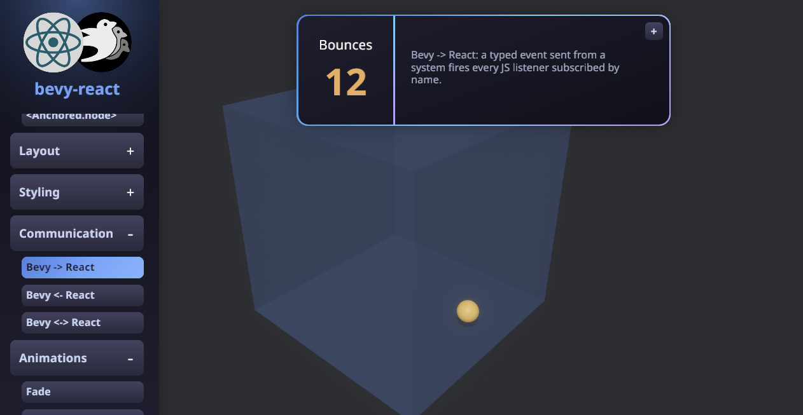
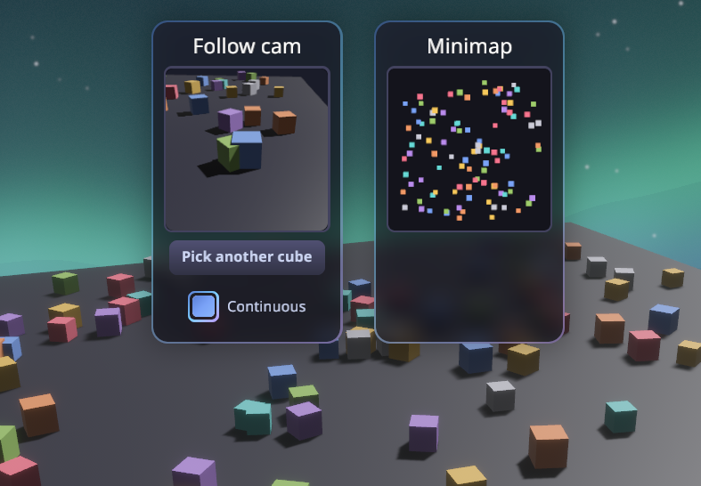
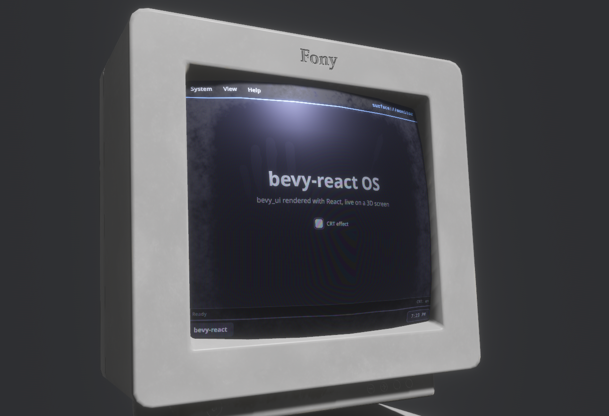
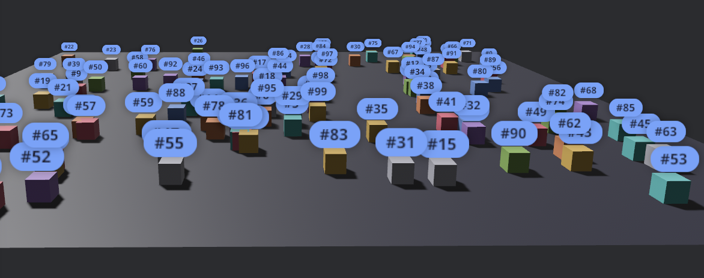

# bevy-react

[](https://docs.rs/bevy-react)

Build [`bevy_ui`](https://docs.rs/bevy/latest/bevy/ui/index.html) interfaces with
**React**. You write components in React/TSX and they render to native Bevy UI
through a **React Native-style bridge** - **no web view, no DOM**. The JS side stays
purely declarative; Rust and Bevy do the heavy lifting. State and interactions flow
both ways between your Bevy app and React, and edits hot-reload live while keeping
component state.

You can play with a live demo here:

https://tulustul.github.io/bevy-react/



```tsx
import { mount } from "bevy-react";
import { useState } from "react";

function App() {
  const [n, setN] = useState(0);
  return (
    <node style={{ padding: 20, gap: 12, flexDirection: "column" }}>
      <text>{`Count: ${n}`}</text>
      <button
        onClick={() => setN((c) => c + 1)}
        style={{ backgroundColor: "#7aa2f7" }}
      >
        <text>+</text>
      </button>
    </node>
  );
}

mount(<App />);
```

That's a real component - `<node>` and `<button>` render to actual `bevy_ui`
nodes, `useState` works as you'd expect, and saving the file updates the running
app without losing the count.

## Why bevy-react

- **React, not a bespoke UI DSL.** Hooks, components, conditional rendering, lists -
  everything you already know.
- **Native Bevy UI.** No browser, no web view. Your UI is `bevy_ui` entities in the
  same world as your game.
- **Hot reload that keeps state.** Edit a component and it re-renders live with hook
  state and running animations intact.
- **Typed, two-way messaging.** React and the ECS talk over typed channels generated
  straight from your Rust types.

## How it works

bevy-react uses a **bridge architecture**, much like old versions of React Native - but the native
side is Bevy and the ECS instead of iOS/Android views.

- **React runs on embedded V8.** The JS runs in a V8 isolate via
  [`deno_core`](https://crates.io/crates/deno_core) - no Node, no browser.
- **The JS engine runs on its own thread.**
- **JS only describes the UI.** React renders through a custom reconciler that emits
  declarative UI-mutation ops; Rust applies them to `bevy_ui` entities. All the heavy
  lifting - layout, input, rendering - happens in Rust and Bevy.
- **Animations are orchestrated in Bevy, not JS.** Shared values and transitions are
  driven on the Bevy side every frame; JS just declares the target. No per-frame JS,
  no bridge traffic per tick.

## Project status

Currently, the project is a **quick, vibecoded proof of concept** demonstrating the idea. The API is very unstable and will change, the code quality is not satisfying.
**Do not use it in production**.

## The demos app

[`examples/demos`](./examples/demos) is a gallery that exercises every feature above,
with a left-nav that switches between live demos. It's the best **reference
implementation** - each demo is a small, self-contained component you can read and
copy when wiring up your own UI, messaging, or animations.

```sh
npm install
npm run build -w demos-app
cargo run --example demos
```

## Getting started

Scaffold the React UI for a new project in one command:

```sh
npx bevy-react init ui   # creates ui/ with package.json, tsconfig, build, and a starter App
```

See **[SETUP.md](./SETUP.md)** for setting up a new project end to end - the Rust
host, the React app, bundling, and typed bindings.

bevy-react is a Rust crate (`bevy-react`) plus an npm package (`bevy-react`),
developed together. Both are `0.1.0` and not yet published, so for now you depend on
them by path or git.

## Features

### Elements & styling

Host elements `<node>`, `<button>`, `<text>`, `<image>`, `<editableText>`,
`<canvas>`, `<portal>`, and `<surface>` cover layout, input, drawing, embedded 3D
views, and UI rendered onto 3D meshes.
Style them with a flexbox/grid object (colors, spacing, borders, radius, shadows,
transforms).

```tsx
<node
  style={{
    flexDirection: "row",
    gap: 16,
    padding: 20,
    backgroundColor: "#1e1e2e",
    borderRadius: 8,
  }}
>
  <text style={{ fontSize: 18, color: "#cdd6f4" }}>Hello</text>
</node>
```

### Hover & press states

Overlay extra style while an element is hovered or pressed - no state wiring needed.

```tsx
<button
  onClick={() => save()}
  style={{ backgroundColor: "#7aa2f7" }}
  hoverStyle={{ backgroundColor: "#89b4fa" }}
  pressStyle={{ backgroundColor: "#5a7fd6" }}
>
  <text>Save</text>
</button>
```

### Pointer & drag

`onPointerDown` / `onPointerMove` / `onPointerUp` give you drag gestures, with both
element-normalized (`x`, `y`) and window (`clientX`, `clientY`) coordinates.

```tsx
<node
  onPointerDown={(e) => start(e.clientX, e.clientY)}
  onPointerMove={(e) => drag(e.clientX, e.clientY)}
  onPointerUp={() => drop()}
/>
```

### Transitions

Ease changes to a style by listing which properties should animate, with timing or
spring config.

```tsx
<button
  onClick={() => setOn((v) => !v)}
  style={{
    backgroundColor: on ? "#a6e3a1" : "#45475a",
    transform: { translateX: on ? 36 : -36 },
    transition: {
      transform: { stiffness: 180, damping: 14 }, // spring
      backgroundColor: { duration: 200 }, // timing (ms)
    },
  }}
>
  <text>{on ? "ON" : "OFF"}</text>
</button>
```

### Animations

For richer motion, use Reanimated-style shared values driven on the Bevy side (no
per-frame JS). Create a value with `useSharedValue`, assign it a driver, and bind it
through `animatedStyle` on an `Animated.*` element.

```tsx
import { Animated, useSharedValue, withRepeat, withTiming } from "bevy-react";
import { useEffect } from "react";

function Pulse() {
  const opacity = useSharedValue(1);
  useEffect(() => {
    opacity.value = withRepeat(
      withTiming(0, { duration: 500, easing: "easeInOut" }),
      -1, // repeat forever
      true, // ping-pong
    );
  }, [opacity]);

  return (
    <Animated.node
      style={{ width: 80, height: 80 }}
      animatedStyle={{ opacity }}
    />
  );
}
```

Drivers: `withTiming`, `withSpring`, `withRepeat`, `withSequence`, `withDelay`, plus
`interpolate` / `interpolateColor` to map one value through a curve.

### Fonts

Register a font on the host, then select it by name in any `<text>` style.

```rust
ReactUiPlugin::new("ui/dist/app.js").font("DancingScript", "assets/dancing.ttf")
```

```tsx
<text style={{ fontFamily: "DancingScript", fontSize: 34 }}>Fancy</text>
```

### Canvas drawing

`<canvas>` takes a `draw` callback with an HTML-canvas-like context; the result is
rasterized into a texture. Returning fresh drawing each render makes it reactive.

```tsx
<canvas
  style={{ width: 460, height: 260 }}
  draw={(ctx) => {
    ctx.strokeStyle = "#89b4fa";
    ctx.lineWidth = 2;
    ctx.beginPath();
    ctx.moveTo(0, 150);
    ctx.bezierCurveTo(100, 0, 200, 150, 300, 20);
    ctx.stroke();
  }}
/>
```

### Render-target portals

`<portal>` shows an **offscreen render target** inside the UI — the live (or
snapshot) output of a Bevy camera rendering into a texture. The app registers a
named target and aims a camera at it; React displays it by name. Good for minimaps,
picture-in-picture, or per-item 3D previews.

```rust
// Bevy: register a target, then point a camera at it.
let view = render_targets.create(&mut images, "follow", RenderTargetSpec::default());
commands.spawn((Camera3d::default(), view.camera_target(), PortalCamera("follow".into())));
```

```tsx
// React: show it by name (Auto-sized to the node, so it stays crisp).
<portal target="follow" style={{ width: 160, height: 160 }} />
```



### Surfaces: UI on a 3D mesh

`<surface>` is the inverse of `<portal>`: instead of showing a 3D camera inside the
UI, it renders a React subtree into an **offscreen texture** that the Bevy app drapes
onto any 3D mesh — a diegetic monitor, panel, or hologram driven by live React. Tag
the displaying mesh with `SurfacePointer` to make the subtree clickable in 3D, so
`onClick`/`onPointer*` and hover/press styles fire from in-world pointer hits.

```rust
// Bevy: register a surface, use its texture on a mesh, make the mesh clickable.
let screen = surfaces.create(&mut images, "monitor", SurfaceSpec { size: UVec2::new(760, 700), ..default() });
material.base_color_texture = Some(screen);
commands.entity(screen_mesh).insert(SurfacePointer::new("monitor"));
```

```tsx
// React: render a subtree into the named surface's texture.
<surface name="monitor" style={{ width: "100%", height: "100%" }}>
  <MonitorApp />
</surface>
```



### World-anchored overlays

Pin UI to a 3D entity so it tracks the entity on screen as the camera moves.

```tsx
import { Anchored } from "bevy-react";

<Anchored.node entity={cube} offset={[0, 1, 0]} style={{ padding: 8 }}>
  <text>Label</text>
</Anchored.node>;
```



### Talking to Bevy

Three typed channels connect React and the ECS:

- **Notify** - `bevy.foo.doSomething(value)`: React -> Bevy event
- **Request** - `await bevy.foo.getSomething()`: request/response cycle
- **Subscribe** - `bevy.on(eventName, callback)`: Bevy → React events

**1. Define the channel in Rust** with a macro and register it on the `App`:

```rust
use bevy::prelude::*;
use bevy_react::{ReactAppExt, ReactEvents, react_event, react_message};

// React → Bevy: `bevy.game.reset()`.
#[react_message(name = "game.reset")]
struct Reset;

fn on_reset(_: On<Reset>, /* queries, resources… */) {
    // reset the game
}

// Bevy → React: `bevy.on("game.scored", …)`.
#[react_event(name = "game.scored")]
struct Scored;

fn award_point(events: ReactEvents) {
    events.send(&Scored);
}

app.add_react_handler(on_reset);
app.add_react_event::<Scored>();
```

**2. Generate the typed client** that React imports from `./bevy`. Add an export
path to your app - typically a flag that builds the `App`, registers your channels,
and calls `app.export_react_typescript("ui/src/bevy.ts")` (see
[SETUP.md](./SETUP.md#talking-to-bevy-typed-channels)) - then run it (re-run whenever
you add or change a channel):

```sh
cargo run -- --export-bindings ui/src/bevy.ts
```

**3. Use it from React:**

```tsx
import { bevy } from "./bevy";
import { useEffect, useState } from "react";

function Score() {
  const [hits, setHits] = useState(0);

  useEffect(() => bevy.on("game.scored", () => setHits((h) => h + 1)), []);

  return (
    <button onClick={() => bevy.game.reset()}>
      <text>{`Hits: ${hits}`}</text>
    </button>
  );
}
```

See [SETUP.md](./SETUP.md#talking-to-bevy-typed-channels) for the request (await a
reply) and event (Bevy → React) channels.

## Performance

Executed against commit ff6287785958e14b752d78fae5cd43d47e760b64

Spec: AMD Ryzen 7 5800X 8-Core, 32GB, GeForce RTX 3070

Rows manipulations benchmark:

`npm run build:prod -w stress-app`

`cargo run --release -p bevy-react --example stress -- --run table-ops --out benchmark_results/results.json`

## Median per op — 1k table (p50, ms)

| Op | Rows | Ops Emitted | Total | Pre-apply | JS | Flush | Translate | Command | Layout | Bevy |
| --- | ---: | ---: | ---: | ---: | ---: | ---: | ---: | ---: | ---: | ---: |
| create | 0 | 4001 | 51.594 | 16.948 | 14.000 | 10.000 | 3.413 | 20.821 | 10.621 | 31.477 |
| append1 | 1000 | 5 | 2.388 | 0.736 | 1.000 | 0.000 | 0.011 | 0.412 | 1.194 | 1.585 |
| append1k | 1001 | 4001 | 53.300 | 16.410 | 14.000 | 10.000 | 3.408 | 20.646 | 12.343 | 33.427 |
| insert1 | 1000 | 5 | 2.799 | 0.733 | 1.000 | 0.000 | 0.150 | 0.438 | 1.251 | 1.714 |
| insertEvery2nd | 1001 | 2001 | 27.800 | 8.245 | 7.000 | 5.000 | 1.901 | 10.478 | 7.337 | 17.689 |
| updateText1 | 1000 | 1 | 2.415 | 0.813 | 1.000 | 0.000 | 0.001 | 0.357 | 1.249 | 1.597 |
| updateTextEvery2nd | 1000 | 500 | 15.919 | 4.040 | 2.000 | 1.000 | 0.154 | 6.793 | 4.918 | 11.711 |
| updateColor1 | 1000 | 1 | 1.635 | 0.807 | 1.000 | 0.000 | 0.007 | 0.302 | 0.503 | 0.815 |
| updateColorEvery2nd | 1000 | 500 | 5.712 | 4.346 | 4.000 | 2.000 | 0.471 | 0.354 | 0.509 | 0.859 |
| swap1 | 1000 | 997 | 8.332 | 6.204 | 4.000 | 2.000 | 0.585 | 0.281 | 1.302 | 1.590 |
| swapEvery2nd | 1000 | 500 | 4.798 | 2.868 | 2.000 | 1.000 | 0.362 | 0.306 | 1.239 | 1.566 |
| remove1 | 1000 | 2 | 2.351 | 0.734 | 1.000 | 0.000 | 0.006 | 0.332 | 1.222 | 1.571 |
| removeEvery2nd | 999 | 500 | 6.437 | 2.478 | 2.000 | 1.000 | 0.850 | 1.924 | 1.189 | 3.116 |
| clear | 1000 | 1001 | 8.286 | 3.145 | 2.000 | 2.000 | 1.486 | 3.134 | 0.545 | 3.636 |

## Median per op — 10k table (p50, ms)

| Op | Rows | Ops Emitted | Total | Pre-apply | JS | Flush | Translate | Command | Layout | Bevy |
| --- | ---: | ---: | ---: | ---: | ---: | ---: | ---: | ---: | ---: | ---: |
| create | 0 | 40001 | 946.609 | 557.429 | 458.000 | 173.000 | 50.832 | 200.118 | 117.214 | 318.829 |
| append1 | 10000 | 5 | 23.485 | 5.438 | 4.000 | 0.000 | 0.012 | 1.197 | 16.817 | 18.020 |
| append1k | 10001 | 4001 | 77.128 | 23.464 | 16.000 | 9.000 | 3.834 | 21.846 | 26.595 | 48.454 |
| insert1 | 10000 | 5 | 37.715 | 19.143 | 6.000 | 0.000 | 0.916 | 1.289 | 16.936 | 18.339 |
| insertEvery2nd | 10001 | 20001 | 373.027 | 166.965 | 110.000 | 89.000 | 26.011 | 101.702 | 77.451 | 178.360 |
| updateText1 | 10000 | 1 | 23.840 | 5.626 | 5.000 | 0.000 | 0.002 | 1.153 | 16.655 | 17.812 |
| updateTextEvery2nd | 10000 | 5000 | 162.128 | 40.093 | 26.000 | 9.000 | 1.431 | 66.112 | 55.697 | 121.811 |
| updateColor1 | 10000 | 1 | 15.565 | 5.794 | 5.000 | 0.000 | 0.008 | 1.092 | 8.630 | 9.761 |
| updateColorEvery2nd | 10000 | 5000 | 69.458 | 55.130 | 40.000 | 19.000 | 4.471 | 1.923 | 8.284 | 10.103 |
| swap1 | 10000 | 9997 | 415.951 | 391.249 | 352.000 | 35.000 | 7.378 | 1.467 | 16.132 | 17.601 |
| swapEvery2nd | 10000 | 5000 | 46.682 | 25.579 | 15.000 | 7.000 | 3.403 | 1.424 | 16.357 | 17.764 |
| remove1 | 10000 | 2 | 37.275 | 19.808 | 6.000 | 0.000 | 0.008 | 1.207 | 16.855 | 17.967 |
| removeEvery2nd | 9999 | 5000 | 93.248 | 23.763 | 14.000 | 7.000 | 6.572 | 32.544 | 29.986 | 62.679 |
| clear | 10000 | 10001 | 142.168 | 64.751 | 41.000 | 34.000 | 15.344 | 55.915 | 5.778 | 61.152 |

### Legend

| Column          | Meaning                                                                                                                              |
| --------------- | ------------------------------------------------------------------------------------------------------------------------------------ |
| **Op**          | The operation under test (create1k, swap, clear, …).                                                                                 |
| **Ops Emitted** | Size of the flushed op batch React produced |
| **Total**       | End-to-end wall time, event trigger → change detected. Equals `Pre-apply + Translate + Bevy`.                                        |
| **Pre-apply**   | Trigger → Bevy starts applying the batch. Covers the JS round-trip + inter-thread scheduling. Contains **JS**.                       |
| **JS**          | React reconcile + build the op batch + the `op_flush` call (measured on the JS thread). Subset of **Pre-apply**; contains **Flush**. |
| **Flush**       | The `op_flush` native call alone = `serde_v8` decode of the batch. Subset of **JS**.                                                 |
| **Translate**   | `apply_js_ops` walks the op batch → queues ECS commands (Bevy side).                                                                 |
| **Command**     | Execute the queued ECS commands + UI prepare/content, before layout.                                                                 |
| **Layout**      | `bevy_ui` layout: taffy solve + transform/clip propagation.                                                                          |
| **Bevy**        | Apply done → change detected. Full post-translate Bevy wall time; ≈ `Command + Layout`.                                              |

