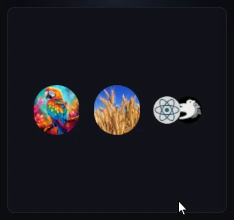
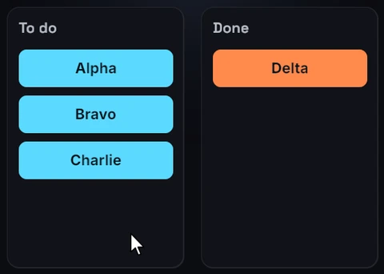

# Shared elements

React has no reparenting: moving a node to another parent or screen is
always an unmount plus the mount of a new node. Shared elements connect the
two. Give the outgoing and the incoming node the same `sharedTag`, and when
one commit swaps them, the incoming node starts where the outgoing one
visually was (its position, size, colors, opacity, transforms and filters)
and eases to its own layout and style. The commit is the trigger: there is
nothing to measure and nothing to start.

## Usage

A thumbnail in a grid:

```tsx
<image
  src={item.src}
  sharedTag={`hero-${item.id}`}
  onClick={() => setOpen(item)}
  style={{
    width: 72,
    height: 72,
    borderRadius: 36,
    transition: { sharedElement: { duration: 450, easing: "easeInOut" } },
  }}
/>
```

The hero of the detail screen that replaces the grid:

```tsx
<image
  src={item.src}
  sharedTag={`hero-${item.id}`}
  style={{
    width: 240,
    height: 240,
    borderRadius: 12,
    transition: { sharedElement: { duration: 450, easing: "easeInOut" } },
  }}
/>
```

One state change (`open ? <Detail item={open} /> : <Grid />`) unmounts the
thumbnail and mounts the hero in the same commit, so the hero takes off from
the thumbnail's circle and grows into place. Going back reverses it: the
thumbnail is then the incoming node.

## Pairing

A pair forms when a single commit unmounts a node with a tag and mounts a
node with the same tag:

- The outgoing node may be the unmounted node itself or anywhere inside an
  unmounted subtree, such as a whole screen.
- Both are the same element type: `<image>` with `<image>`, `<button>` with
  `<button>`.
- Both are under the same UI root. A [`<surface>`](../elements/surface.md) or
  [`<root>`](../elements/root.md) subtree is a root of its own.
- The incoming node carries the tag when it mounts, and its base style has
  `transition: { sharedElement }`. Without that entry the pair forms but the
  node just appears.
- When several unmounting nodes carry the tag, the one mounted first is used,
  and it seeds every incoming node with the tag.

A tag that matches nothing mounts normally, without a warning, and `""`
counts as no tag. Make tags unique per screen, for example `hero-${id}`.

## What carries over

The incoming node starts from the outgoing node's:

- rect as it was on screen, position and size, including ancestor
  transforms and any flight or layout transition still in progress;
- `transform`, `opacity`, `backgroundColor` and `borderRadius`;
- `filter` and `backdropFilter` chains, `backgroundGradient`,
  `borderGradient` and `transform3d`.

Each then eases to the incoming node's own value. Everything else (text
color, border color, children, text, the image source) is the incoming
node's from the first frame. If the outgoing node had no background color,
the incoming one fades its own color in.

These values are read as shown only when the outgoing node has a
`transition` style. Without one, only its rect, transform and background
color carry over, and the rest starts from defaults (opacity 1, square
corners, no filter). Giving both nodes the same `transition` covers this,
and makes the flight work in both directions.

## The flight

- **Size flies through real layout.** The node's width and height ease in
  pixels from the outgoing size to its own, so the parent re-flows every
  frame and the children are laid out at each size: nothing is stretched.
  When the flight lands, the node's authored size is restored. While it
  flies, the node's `flexGrow` and `flexShrink` are suspended so flex
  layout does not fight the eased size.
- **Position flies by translation**, in a straight line from where the
  outgoing node was to where the incoming one settles, even when its parent
  re-flows around the growing node. A scroll or a resize under the flight
  moves both ends with the content.
- The first frame shows the outgoing rect exactly, with no blank frame. The
  outgoing node itself is gone at once.
- Swapping back mid-flight starts the new flight from wherever the node is
  on screen.
- A tagged node inside another tagged node flies its own straight path.
- An `{ animated }` binding on one of the node's layout fields (`width`,
  `height`, …) owns its size: the size does not fly.

## Timing

- The rect (position and size) flies with the `sharedElement` spec.
- Every other carried value uses the node's own `transition` entry for its
  channel when it has one (`backgroundColor`, `opacity`, …), and the
  `sharedElement` spec otherwise.
- Once the flight has started, later changes ease with their regular
  channels: a hover in mid-flight behaves as usual.

See [Style transitions](style-transitions.md#timing) for the spec fields.

## With layout transitions

`sharedElement` and `layout` compose. On this board, a clicked ticket
unmounts from one column and mounts in the other in the same commit. It
takes off from where it sat, easing its width and color to the new
column's, while the tickets left behind close the gap with their own
`layout` transition:

```tsx
<button
  key={id}
  sharedTag={`item-${id}`}
  onClick={() => move(id)}
  style={{
    width: "100%",
    height: 36,
    backgroundColor: done ? "#9ece6a" : "#7aa2f7",
    globalZIndex: 1,
    transition: {
      sharedElement: { duration: 400, easing: "easeOut" },
      layout: { duration: 400, easing: "easeOut" },
    },
  }}
>
  <text>{id}</text>
</button>
```

## Fading the rest of a screen

The outgoing node unmounts at once, and so does the rest of its screen. To
fade or slide the old screen out, keep it mounted (absolutely positioned
over or under the new one) and, in the navigation commit, replace only its
tagged node with an untagged placeholder of the same size. That unmount
still pairs. Unmount the old screen once its exit animation ends, from a
[completion callback](animated-values.md#completion-callbacks).

## Tips

- The flight is drawn inside the new parent: that parent's `overflow` clips
  it, and it paints in the new parent's stacking order. Keep the flight path
  unclipped, and raise the node with `zIndex` or `globalZIndex` when it must
  pass over other content (see [Z-index](../styling/z-index.md)).
- With Bevy's layout rounding, a size flying through real layout grows in
  whole pixel steps and its surroundings hop. Set `layoutRounding: false` on
  the container the flight re-flows (see
  [Layout rounding](../styling/layout-rounding.md)).
- The flight changes the node's real size, so its ancestors re-flow too.
  Put the flying node in a parent that holds constant space, such as a
  fixed-size slot.
- Give the incoming node an explicit size. An `<image>` sized by its texture
  measures 0×0 until the texture has loaded, and that axis does not fly.

## Limits

- Both halves must be in one commit. A node that mounts a commit later, for
  example behind Suspense or from a state set in an effect, does not pair.
- There is no completion callback for a flight.
- The incoming node's own size and settled position are measured once, when
  the flight starts. Moves the flight did not cause (a scroll, a sibling
  inserted) are followed; a change to the node's own size during the flight
  shows when it lands.
- Text spans and SVG shapes have no layout box and cannot be shared.





See [`sharedTag`](../reference/elements.md#identity) in the element reference
and [`transition`](../reference/style-properties.md#transition) in the style
reference.
