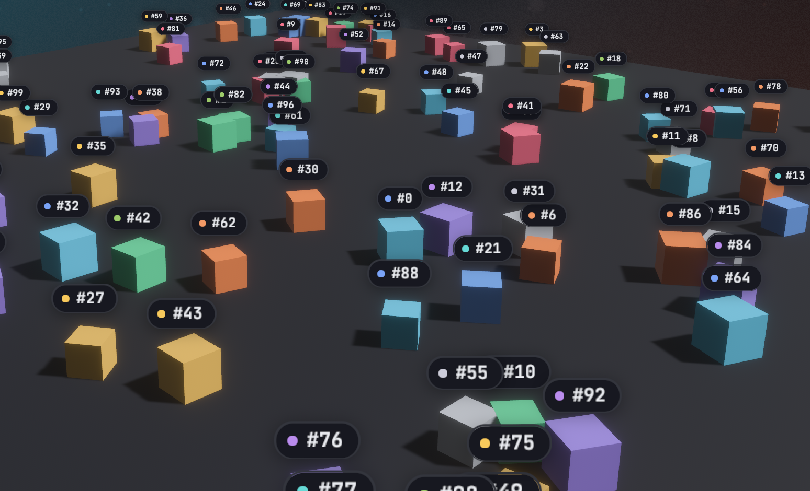

# `<anchor>`

`<anchor>` pins a UI subtree to a 3D entity. Every frame it projects the
entity's world position through the UI camera and centers itself on that
point, so labels, nameplates and health bars follow objects as they and the
camera move. It stays an ordinary screen-space node: flat, styled like
`<node>`, and fully interactive.

## Usage

React needs the entity's id, `Entity::to_bits()`, from the Bevy side. Here a
[request](../communication/request-response.md) asks for it:

```tsx
import { useEffect, useState } from "react";
import { bevy } from "./bevy";

function PlayerLabel() {
  const [player, setPlayer] = useState<bigint | null>(null);
  useEffect(() => {
    bevy.player.entity().then(setPlayer);
  }, []);
  if (player === null) return null;
  return (
    <anchor entity={player} offset={[0, 2, 0]}>
      <text>Player 1</text>
    </anchor>
  );
}
```

```rust
use bevy::prelude::*;
use bevy_react::prelude::*;

#[derive(Component)]
struct Player;

#[react_request(name = "player.entity", response = u64)]
struct PlayerEntity;

fn player_entity(
    req: On<Request<PlayerEntity>>,
    player: Query<Entity, With<Player>>,
) {
    match player.single() {
        Ok(entity) => req.respond(entity.to_bits()),
        Err(_) => req.respond_err("no player"),
    }
}

// app.add_react_request_handler(player_entity);
```

An event works as well, for example one listing every spawned unit with its
`entity.to_bits()` (see [Bevy to React](../communication/bevy-to-react.md)).

`<anchor>` comes from the `anchor` cargo feature, which is on by default and
adds `AnchorPlugin` to `ReactPlugins`. Without it, an `<anchor>` mounts as a
plain node and reports a `featureMissing` warning (see
[Cargo features](../getting-started.md#cargo-features)).

## Attributes

| Attribute | Type                 | Default     | Effect                                            |
| --------- | -------------------- | ----------- | ------------------------------------------------- |
| `entity`  | `number` or `bigint` | required    | The entity to follow, as `Entity::to_bits()`      |
| `offset`  | `[x, y, z]`          | `[0, 0, 0]` | World-space offset added to the entity's position |
| `scale`   | `AnchorScaling`      | none        | Scale the overlay with camera distance            |

All three are plain props: change them from React state and the anchor
follows the new values.

## Positioning

- The anchor point is the entity's `GlobalTransform` translation plus
  `offset`, in world units. Use `offset` to lift a label above a model's
  origin.
- The point is projected through the camera marked `IsDefaultUiCamera`, or,
  if none is marked, the first camera found. Mark your main camera when the
  app has several, including [`<portal>`](portal.md) cameras and
  [`<surface>`](surface.md) cameras.
- The overlay is centered on the point using its own laid-out size, and is
  positioned after animations and transitions run, so it tracks the entity in
  the same frame. Moving it never re-runs layout.
- The overlay is hidden while the entity doesn't exist (not spawned yet,
  despawned, or an invalid `entity` value) and while the point is behind the
  camera or beyond its far plane. A point off to the side of the screen keeps
  the overlay positioned off-screen. A new anchor is also hidden until its
  first layout, so it never flashes at the wrong place.

## Distance scaling

`scale` takes `{ min, max, factor, baseDistance }` and scales the overlay
around its center by
`clamp(1 + factor * (baseDistance / distance - 1), min, max)`, where
`distance` is from the camera to the anchor point, in world units. The
overlay is at scale 1 when the camera is `baseDistance` away, grows as the
camera comes closer and shrinks as it moves away. A `factor` of `0` disables
scaling, `1` is true perspective (half the size at twice the distance), and
`2` scales twice as fast. Without `scale`, the overlay keeps its size.

```tsx
<anchor
  entity={player}
  offset={[0, 2, 0]}
  scale={{ min: 0.4, max: 2, factor: 1, baseDistance: 20 }}
>
  <text>Player 1</text>
</anchor>
```

A non-finite field disables scaling with a log warning; a `min` greater than
`max` is swapped.

## Layout and styling

- `<anchor>` takes everything `<node>` does: `style`, `hoverStyle`,
  `pressStyle`, `focusStyle`, pointer handlers, `onWheel` and the scroll
  props. Its children lay out inside it as usual, and it sizes to its
  content.
- It doesn't take part in its React parent's layout: it takes no space
  there, isn't clipped by the parent's `overflow` and doesn't extend its
  scroll range. Write it anywhere in the tree; unmounting the parent removes
  it.
- Anchors live in their own UI root at the window's top-left, drawn beneath
  the app's other UI roots. Give an `<anchor>` a `globalZIndex` to draw it
  above them (see [Z-index](../styling/z-index.md)).
- The anchor owns its position: `positionType`, `left` and `top` are
  overridden, and so are `translateX`, `translateY`, `scale`, `scaleX` and
  `scaleY` in its `transform` style, static, transitioned or animated.
  `rotate` works. Put other transforms on a child.
- Clicks and hover work as on any node.

## Limits

- No occlusion: an overlay stays visible when its entity is hidden behind
  other geometry.
- Only the position is followed. The overlay doesn't rotate or skew with the
  entity.
- Overlays follow one camera and appear only on the main screen, not in
  portals or surfaces.
- `entity` crosses as a JS number, exact below 2^53, which covers realistic
  Bevy entity ids.



See [`<anchor>`](../reference/elements.md#anchor) in the element reference.
