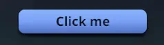

# `<button>`

`<button>` is a [`<node>`](node.md) meant for controls. It takes the same
style and props as a `<node>` and has no built-in look; what it adds is
pointer behavior: it blocks the pointer by default, always tracks hover and
press, and owns every click that lands inside it. On the Bevy side it
carries `bevy_ui`'s `Button` component.

## Usage

```tsx
const [count, setCount] = useState(0);

<button
  onClick={() => setCount((c) => c + 1)}
  style={{
    padding: { horizontal: 16, vertical: 8 },
    borderRadius: 8,
    backgroundColor: "#7aa2f7",
    cursor: "pointer",
  }}
  hoverStyle={{ backgroundColor: "#89b4fa" }}
  pressStyle={{ backgroundColor: "#5a7fd6" }}
>
  <text style={{ color: "#1a1b26" }}>Clicked {count} times</text>
</button>;
```

`hoverStyle` and `pressStyle` give the button its feedback with no React
state. See [State styles](node.md#state-styles) for the overlay rules.

## How it differs from `<node>`

|                       | `<node>`                                 | `<button>`                            |
| --------------------- | ---------------------------------------- | ------------------------------------- |
| Default `focusPolicy` | `"pass"`                                 | `"block"`                             |
| Owns clicks           | Only with `onClick` or an `onPointer*`   | Always, with or without `onClick`     |
| Hover and press state | Tracked only with state styles, handlers | Always tracked (Bevy's `Interaction`) |
| Bevy components       | `Node`                                   | `Node`, `Button`, `Interaction`       |

### It blocks the pointer

A press on a button stops there: the 3D scene, siblings behind it and its
ancestors don't receive it, so clicking a toolbar button doesn't also start
a camera drag. Set `focusPolicy: "pass"` in its style to let the pointer
through; unsetting it returns to `"block"`. See
[Focus policy](../styling/focus-policy.md).

Blocking also ends hover for what is beneath: while the pointer is over the
button, a hover-styled card around it loses its `hoverStyle` and gets an
`onPointerLeave`. Give the button `focusPolicy: "pass"` if the card should
stay hovered.

### It owns its clicks

- A click anywhere inside the button, on its `<text>` label or any other
  child, fires the button's `onClick`.
- A button without `onClick` still takes the click: an `onClick` on one of
  its ancestors does not fire. Clicks never bubble.
- A child with its own `onClick` or `onPointer*` handler gets the click
  instead of the button.
- `onClick` fires for the primary mouse button (or a tap) on release over the
  button the press started on. Pressing, dragging off and releasing
  elsewhere does not click. For other buttons use `onPointerDown` and read
  `e.button`. See [Mouse](../events/mouse.md).

## Building a button component

The element is deliberately bare: wrap it once in your own component with
your look, label styles and press feedback. The demo app's `Button`
([`components/Button.tsx`](../../../examples/demos/ui/src/components/Button.tsx))
is a fuller example, combining gradients, a `pinch`
[filter](../styling/filters.md) driven by an
[animated value](../animations/animated-values.md), and a shadow that
flattens while pressed.



## Limits

- There is no `disabled` attribute. To disable a button, drop its `onClick`
  (it still swallows the click) and style it as disabled.
- A `<button>` is not focusable and has no keyboard activation: Tab, Enter
  and Space don't reach it. `focusStyle` applies only if your Rust code
  gives the entity Bevy's `InputFocus`.
- There is no `ariaLabel`. Bevy names the button for assistive tech from
  its child text when it mounts, so an icon-only button has no name.

See [`<button>`](../reference/elements.md#button) in the element reference.
