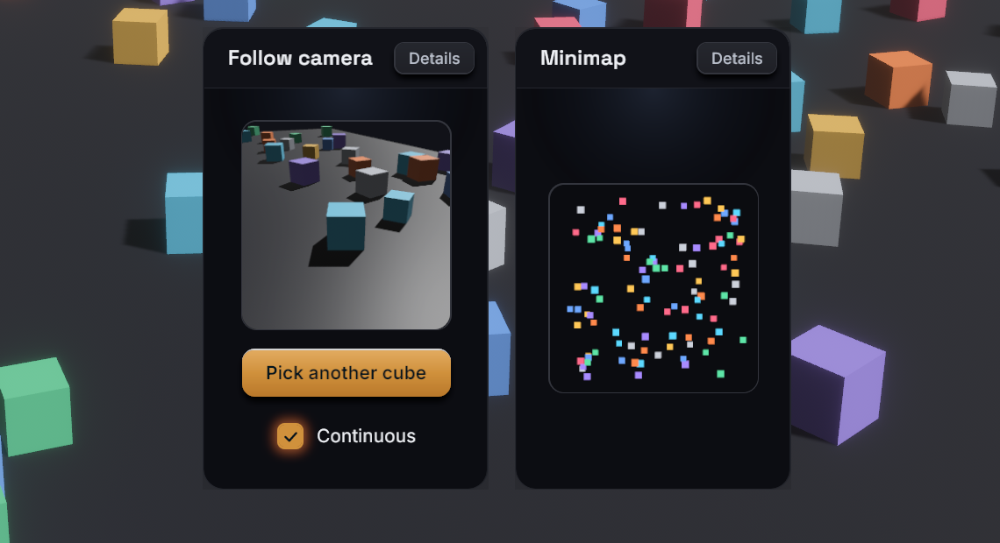

# `<portal>`

`<portal>` shows a named render target inside the UI: usually the output of a
Bevy camera that renders into a texture, for a minimap, a picture-in-picture
view or a 3D item preview. It is a styled node like `<node>`, whose image is
the target's texture stretched over the node. Your app owns the cameras and
registers each target under a name in the `RenderTargets` resource. React
displays a target by that name.

## Usage

```tsx
<portal target="minimap" style={{ width: 160, height: 160 }} />
```

```rust
use bevy::prelude::*;
use bevy_react::{PortalCamera, RenderTargetSpec, RenderTargets};

fn setup(
    mut commands: Commands,
    mut targets: ResMut<RenderTargets>,
    mut images: ResMut<Assets<Image>>,
) {
    let minimap = targets.create(
        &mut images,
        "minimap",
        RenderTargetSpec::default(),
    );
    commands.spawn((
        Camera3d::default(),
        Transform::from_xyz(0.0, 30.0, 0.0)
            .looking_at(Vec3::ZERO, Vec3::NEG_Z),
        minimap.camera_target(),
        PortalCamera("minimap".into()),
    ));
}
```

`<portal>` comes from the `portal` cargo feature, which is on by default and
adds `PortalPlugin` to `ReactPlugins`. Without it, a `<portal>` mounts as a
plain node and reports a `featureMissing` warning (see
[Cargo features](../getting-started.md#cargo-features)). The `RenderTargets`
registry is part of the core and always available.

## Render targets

`RenderTargets::create(&mut images, name, spec)` allocates a texture and
registers it under `name`. It returns a `RenderTarget` whose
`camera_target()` is the Bevy `RenderTarget` component that points a camera
at the texture. Creating an existing name again replaces it.

- Tag the camera with `PortalCamera(name)` so bevy-react decides when it
  renders (see "Render modes"). An untagged camera renders every frame.
- The name is the only link between the two sides. Use a constant both sides
  know, or send it to React with an event (see
  [Bevy to React](../communication/bevy-to-react.md)).
- A `<portal>` whose target doesn't exist yet is transparent, and shows the
  texture as soon as the target is created. Changing `target` switches
  textures.
- `remove(name)` drops a target: its portals turn transparent again.
  Despawn the camera yourself.
- `register(name, handle)` registers an `Image` you already have (generated
  or loaded) under a name. It is static: nothing renders into it or resizes
  it.
- `get(name)` returns a target's texture handle.

Use `RenderLayers` on the camera and on what it should see to give a portal
its own scene, as a minimap camera drawing flat markers does.

## Target options

`RenderTargetSpec` configures a target:

| Field    | Default                         | Meaning                                                   |
| -------- | ------------------------------- | --------------------------------------------------------- |
| `size`   | `Resolution::Auto`              | `Auto` follows the portal's size; `Fixed(UVec2)` is fixed |
| `mode`   | `RenderMode::Live`              | When the camera renders (see below)                       |
| `format` | `TextureFormat::Rgba8UnormSrgb` | Texture format                                            |

- `Resolution::Auto` sizes the texture to the portal's laid-out size in
  physical pixels, rounded up to a multiple of 16, so the output is crisp and
  the camera has the portal's aspect ratio. It assumes one portal per target:
  with several, the last one bound decides the size.
- `Resolution::Fixed(size)` keeps one size whatever the layout, for a target
  shown in several places. The texture stretches to each portal's box.
- Both are capped at 2048 pixels per side.
- Use an HDR format such as `Rgba16Float` when the camera needs HDR, for
  example for bloom.

## Render modes

- `RenderMode::Live`: the camera renders every frame while at least one
  portal showing the target is visible. A portal that is unmounted,
  `display: "none"` or scrolled entirely out of its clipping ancestor
  doesn't count, so a target nobody sees costs nothing. A portal
  that becomes visible shows a fresh frame at once.
- `RenderMode::Snapshot`: the camera renders once when the target is
  created, when you call `invalidate(name)`, when an `Auto` target resizes,
  and when its mode changes, then stops. The texture keeps the last frame:
  cheap for static thumbnails. A snapshot renders even while no portal shows
  it, so it is ready when one does.

`set_mode(name, mode)` switches at runtime. Going from `Live` to `Snapshot`
renders one last frame, then freezes. For example, a React button can
pause a preview through a [message](../communication/react-to-bevy.md):

```tsx
import { useState } from "react";
import { bevy } from "./bevy";

function PreviewToggle() {
  const [live, setLive] = useState(true);
  const toggle = () => {
    setLive(!live);
    bevy.preview.setLive(!live);
  };
  return (
    <button onClick={toggle}>
      <text>{live ? "Pause preview" : "Resume preview"}</text>
    </button>
  );
}
```

```rust
use bevy::prelude::*;
use bevy_react::prelude::*;
use bevy_react::{RenderMode, RenderTargets};

#[react_message(name = "preview.setLive")]
struct SetPreviewLive(bool);

fn on_set_preview_live(
    ev: On<SetPreviewLive>,
    mut targets: ResMut<RenderTargets>,
) {
    let mode = if ev.event().0 {
        RenderMode::Live
    } else {
        RenderMode::Snapshot
    };
    targets.set_mode("preview", mode);
}

// app.add_react_handler(on_set_preview_live);
```

## Styles and events

- `<portal>` takes everything `<node>` does: `style`, `hoverStyle`,
  `pressStyle`, `focusStyle`, pointer handlers, `onWheel` and the scroll
  props.
- It has no intrinsic size: give it a width and a height.
- Pointer events hit the portal's box like any node; they don't reach the
  scene the camera sees.
- `backgroundColor` shows through transparent pixels of the texture, such as
  a camera clear color with alpha. `backgroundImage` is ignored with a
  `styleIgnored` warning.
- `imageRendering` modes other than `"auto"` are not available on a portal
  and report an `imageRendering` warning.
- A live portal inside a [composited layer](../styling/layers.md) (an
  ancestor with a `filter`, `backdropFilter`, `transform3d`, `morphFilter`
  or `cache`, or `opacity` on a node with children) freezes on the layer's
  cached frame:
  the layer can't see the camera's writes. Set `cache: "never"` on the node
  that creates the layer so it re-captures every frame.

A `backgroundImage` with a `{ texture }` source shows a registered target as
a node's background instead. It suits static textures registered with
`register`: see [Background images](../styling/background-images.md).

## Limits

- Each live target is a full extra camera render per frame while it is
  visible.
- Only cameras tagged `PortalCamera` are switched on and off.
- `Auto` resolution assumes one portal per target.
- Textures are capped at 2048 pixels per side, so very large portals render
  at a lower resolution.



See [`<portal>`](../reference/elements.md#portal) in the element reference.
