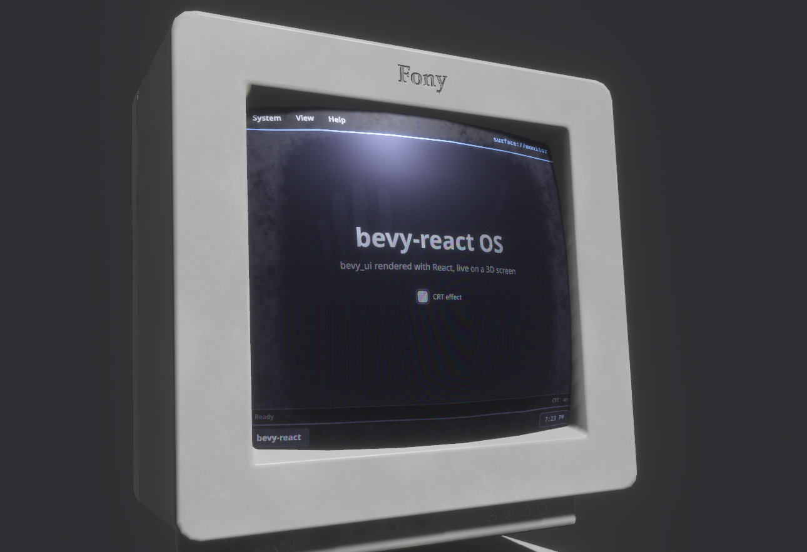

# `<surface>`

`<surface>` renders a React subtree into an offscreen texture instead of onto
the screen. Your Bevy app puts that texture on any material: an in-world
monitor, a control panel, a hologram with your own shader on top. It is the
inverse of [`<portal>`](portal.md), which shows a camera's texture inside the
UI. Tag the mesh that displays the texture with `SurfacePointer` and the UI
on it is clickable in 3D.

## Usage

```tsx
function Monitor() {
  const [count, setCount] = useState(0);
  return (
    <surface target="monitor" style={{ backgroundColor: "#1a1b26" }}>
      <button onClick={() => setCount((n) => n + 1)}>
        <text>{`Clicked ${count} times`}</text>
      </button>
    </surface>
  );
}
```

```rust
use bevy::prelude::*;
use bevy_react::surface::{SurfacePointer, SurfaceSpec, Surfaces};

fn setup(
    mut commands: Commands,
    mut surfaces: ResMut<Surfaces>,
    mut images: ResMut<Assets<Image>>,
    mut meshes: ResMut<Assets<Mesh>>,
    mut materials: ResMut<Assets<StandardMaterial>>,
) {
    let screen = surfaces.create(
        &mut images,
        "monitor",
        SurfaceSpec {
            size: UVec2::new(800, 600),
            ..default()
        },
    );
    commands.spawn((
        Mesh3d(meshes.add(Rectangle::new(4.0, 3.0))),
        MeshMaterial3d(materials.add(StandardMaterial {
            base_color_texture: Some(screen),
            unlit: true,
            ..default()
        })),
        SurfacePointer::new("monitor"),
    ));
}
```

`<surface>` comes from the `surface` cargo feature, which is on by default
and adds `SurfacePlugin` to `ReactPlugins`. Without it, a `<surface>` mounts
as a plain node and reports a `featureMissing` warning (see
[Cargo features](../getting-started.md#cargo-features)).

## Surfaces

`Surfaces::create(&mut images, name, spec)` allocates a texture, registers it
under `name` and returns its `Handle<Image>` for your materials. bevy-react
spawns a UI camera for each surface that renders the matching `<surface>`
subtree into the texture, before the main camera draws, so the texture is
never a frame behind. Creating an existing name again replaces the surface.

`SurfaceSpec` configures it:

| Field         | Default            | Meaning                                                 |
| ------------- | ------------------ | ------------------------------------------------------- |
| `size`        | 512 × 512          | Texture size in pixels, at most 4096 per side           |
| `clear_color` | `Color::BLACK`     | Fills the texture under the UI; transparent for a decal |
| `mode`        | `RenderMode::Live` | When the UI renders (see "Render modes")                |

`get(name)` returns the texture handle, and `invalidate`, `set_mode` and
`remove` work as on render targets. `remove(name)` despawns the surface's
camera and hides its `<surface>` subtrees until the name is created again.

On the React side, `target` names the surface. A `<surface>` whose name isn't
registered yet renders nothing, and appears as soon as the app creates it.
Changing `target` moves the subtree to another surface.

## Layout

- The subtree lays out in the texture's pixel space: one logical pixel is
  one texture pixel, whatever the window's scale factor.
- The `<surface>` element fills the texture by default (`width` and `height`
  `"100%"`). Its `style` overrides that and styles the root like a node.
- The `<surface>` takes no space where you write it in the React tree. Put it
  anywhere, for example beside the screen UI that controls it; unmounting it
  or an ancestor removes it.
- It is a UI root of its own, like [`<root>`](root.md). Layout, `overflow`
  clipping, `layoutRounding` and shared-element pairing don't cross its
  boundary.
- The `<surface>` element itself takes only `target`, `style`, `name` and
  `key`: no pointer handlers or hover styles. Put those on its children.

## Clicking in the world

`SurfacePointer::new(name)` on the entity with the mesh makes the UI on it
interactive. bevy-react casts a ray from the active window camera through the
cursor, finds the nearest `SurfacePointer` mesh, reads the texture coordinate
at the hit, and moves a virtual pointer to that pixel of the surface.

- Children get `onClick`, the `onPointer*` handlers, `hoverStyle` and
  `pressStyle`, and the `cursor` style sets the OS cursor, as on screen.
- The mesh needs UVs, with `(0, 0)` at the texture's top-left. If your
  material maps the surface to the second UV set (`base_color_channel:
UvChannel::Uv1`), match it with
  `SurfacePointer::new(name).with_uv_channel(UvChannel::Uv1)` so clicks land
  on the right pixel.
- Several meshes can display and pick the same surface.
- Only `SurfacePointer` meshes are ray-cast: another mesh in front of the
  screen doesn't block clicks.

## Render modes

- `RenderMode::Live` (the default): the UI renders every frame while at
  least one `SurfacePointer` mesh naming the surface is visible to a camera.
  When every tagged mesh is culled, it renders nothing. A surface with no
  tagged mesh renders every frame, since bevy-react can't tell which
  materials use it, so tag every mesh that shows a surface.
- `RenderMode::Snapshot`: the UI renders once when the surface is created,
  when you call `invalidate(name)` and when its mode changes, then the
  texture keeps that frame. Call `invalidate` after the UI changes; good for
  static panels.

## Limits

- Composited-layer styles have no effect inside a surface: `opacity` on a
  node with children, `filter`, `backdropFilter`, `transform3d`,
  `morphFilter` and `cache` render as if unset, with a `layerCamera` warning.
  See [Layers](../styling/layers.md).
- The mouse wheel doesn't reach surface UI: no wheel scrolling and no
  `onWheel` inside a surface.
- A live surface without a tagged mesh renders every frame, visible or not.
- Textures are capped at 4096 pixels per side.



See [`<surface>`](../reference/elements.md#surface) in the element reference.
