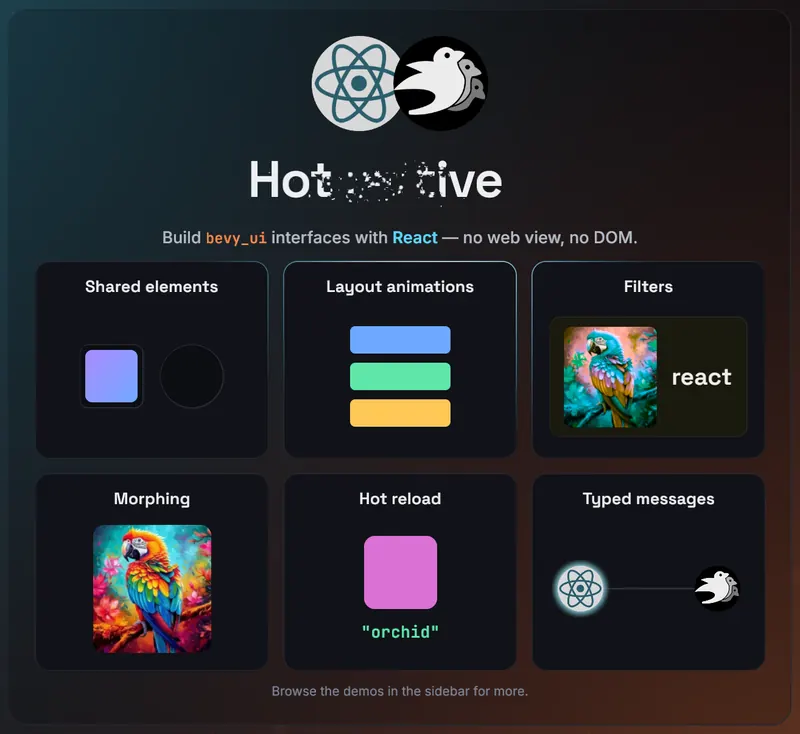

# Introduction

bevy-react lets you build [`bevy_ui`](https://docs.rs/bevy/latest/bevy/ui/index.html)
interfaces with **React**. You write components in React and TSX, and they
render to native Bevy UI through a bridge in the style of React Native. There
is **no web view and no DOM**. The JS side only describes the UI, while Rust
and Bevy handle layout, input and rendering. State and interactions flow both
ways between your Bevy app and React, and edits hot-reload live without
losing component state.

Try the [live demo](https://tulustul.github.io/bevy-react/demo/). It is the
web (wasm) build of the demos gallery and runs in your browser. The UI there
is still `bevy_ui`, not DOM.



```tsx
import { mount } from "bevy-react";
import { useState } from "react";

function App() {
  const [n, setN] = useState(0);
  return (
    <node style={{ padding: 20, gap: 12, flexDirection: "column" }}>
      <text>{`Count: ${n}`}</text>
      <button
        onClick={() => setN((c) => c + 1)}
        style={{ backgroundColor: "#7aa2f7" }}
      >
        <text>+</text>
      </button>
    </node>
  );
}

mount(<App />);
```

This is a real component. `<node>` and `<button>` render to actual `bevy_ui`
nodes, and `useState` works the way it does in any React app. If you save the
file while the app is running, the UI updates and keeps the count.

To set up a project, see [Getting started](getting-started.md).

## Why bevy-react

- **React, not a custom UI DSL.** You get hooks, components, conditional
  rendering and lists, all of which you already know.
- **Native Bevy UI.** There is no web view and no DOM. Your UI is made of
  `bevy_ui` entities in the same world as your game.
- **Hot reload that keeps state.** When you edit a component, it re-renders
  live and keeps its hook state and running animations.
- **Typed, two-way messaging.** React and the ECS talk over typed channels
  generated from your Rust types.
- **Not only UI.** [Custom elements](extending/custom-elements.md) put any
  ECS entity under React's control, such as a 3D mesh whose attributes come
  from component state.

## Project status

bevy-react is a quick, vibe-coded proof of concept that demonstrates the
idea. The API is unstable and will change, and the code quality is not yet
where it should be. **Do not use it in production.**

## Bevy compatibility

| Bevy | bevy-react        |
| ---- | ----------------- |
| 0.19 | 0.1 – 0.6, `main` |

## Performance

The [Performance](performance.md) page has benchmark results for the bridge.
They include per-operation timings for creating, updating, reordering and
removing rows in 1k- and 10k-row tables.

## License

bevy-react is dual-licensed under the
[Apache License 2.0](https://github.com/tulustul/bevy-react/blob/main/LICENSE-APACHE)
or the [MIT license](https://github.com/tulustul/bevy-react/blob/main/LICENSE-MIT),
at your option.
