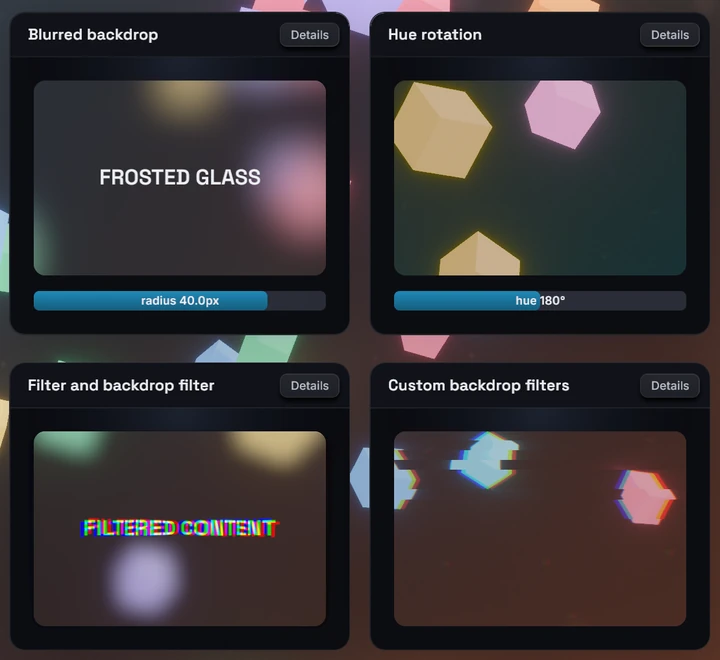

# Backdrop filters

The `backdropFilter` style runs a filter chain over what is rendered behind a
node (the camera's 3D frame) and draws the result under the node's own
background and children. It takes the same chains as the `filter` style,
which filters the node's own subtree instead. A blur under a translucent
background is the classic frosted-glass panel.

## Usage

```tsx
<node
  style={{
    padding: 24,
    borderRadius: 12,
    backgroundColor: "rgba(26, 27, 38, 0.35)",
    backdropFilter: { name: "blur", params: { radius: 8 } },
  }}
>
  <text>frosted glass</text>
</node>
```

## Chains

The value is one `{ name, params }` entry or an ordered array of entries, run
in array order:

```tsx
const glass: BevyStyle = {
  backgroundColor: "rgba(26, 27, 38, 0.35)",
  backdropFilter: [
    { name: "blur", params: { radius: 12 } },
    { name: "saturate", params: { amount: 1.6 } },
  ],
};
```

- `params` and every param in it are optional. An omitted param takes the
  filter's default, which for built-ins is a visible effect: a bare
  `{ name: "blur" }` is a 20px blur, a bare `{ name: "grayscale" }` is full
  grayscale.
- Names and params are typed from your generated `bevy.ts`, built-ins and
  your own `#[react_filter]` filters alike. Without generated bindings the
  field accepts no value.
- An entry with an unknown name or invalid params is skipped with a
  `backdropFilterUnknown` or `backdropFilterParams` devtools warning; the
  rest of the chain still runs. Morph filters (`crossfade`, `linearWipe`,
  `pixelize`) belong to `morphFilter` and are rejected the same way.
- `backdropFilter` and `filter` are independent: one node can carry both, and
  each one resolves, transitions and animates on its own.
- An empty array is the same as no backdrop filter.

## What the backdrop is

- The source is the camera's rendered 3D frame, after tonemapping and
  post-processing, under the node's box. UI is not part of it. With no 3D
  scene behind the UI, the backdrop is the camera's clear color.
- The filtered result is opaque and is drawn directly under the node's
  content. A translucent `backgroundColor` tints the glass, an opaque one
  hides it, and UI painted beneath the node inside its box is covered by the
  filtered scene, not blurred.
- The glass fills the node's border box and follows its `borderRadius`, with
  the same antialiased edge as the background. Ancestor `overflow` clipping
  clips it like the rest of the node.
- `opacity` on the node fades the glass together with its content.
- Blur-like filters sample the scene a little outside the box (a blur reaches
  three times its radius), so the edges stay clean. The glass itself never
  paints outside the box.
- While a filter's shader is still compiling, the node shows the unfiltered
  scene behind it. It never disappears.

## Built-in filters on a backdrop

| Filter                                                                            | On a backdrop                                                                     |
| --------------------------------------------------------------------------------- | --------------------------------------------------------------------------------- |
| `blur`                                                                            | Frosted glass                                                                     |
| `brightness`, `contrast`, `saturate`, `grayscale`, `sepia`, `invert`, `hueRotate` | Recolor the scene behind the node                                                 |
| `bloom`, `chromaticAberration`                                                    | Glow and color fringing                                                           |
| `pinch`                                                                           | Lens-like squeeze or bulge of the scene                                           |
| `gradientMap`                                                                     | A gradient wash; keep `amount` below 1 to see the scene                           |
| `outline`, `shadow`                                                               | Nothing visible: they draw around the content's alpha, and the backdrop is opaque |

Custom `#[react_filter]` filters run on a backdrop unchanged; their shader
receives an opaque source. The filter reference lists every built-in's
params, for example [`blur`](../reference/filters.md#blur).

## Transitions

`transition: { backdropFilter }` eases the chain between style states (the
base `style`, `hoverStyle`, `pressStyle`, `focusStyle`), independently of
`transition: { filter }`:

- Same names in the same order: the params interpolate.
- One chain extends the other at the end, built-in filters only: the extra
  entries fade through their identity values (a blur from radius 0).
- Anything else swaps at the halfway point.
- Easing to no chain at all, by unsetting `backdropFilter` or setting `[]`,
  snaps: the filter disappears at once.

Keep an identity entry in the base style when the filter should fade out as
well as in:

```tsx
<node
  style={{
    backgroundColor: "rgba(26, 27, 38, 0.35)",
    backdropFilter: { name: "blur", params: { radius: 0 } },
    transition: { backdropFilter: { duration: 250 } },
  }}
  hoverStyle={{
    backdropFilter: { name: "blur", params: { radius: 12 } },
  }}
/>
```

The identity entry is not free: it keeps the backdrop running every frame
(see Limits).

## Animated params

Any param accepts an inline `{ animated }` binding to a shared value, driven
every frame on the Bevy side without re-rendering React:

```tsx
import { useSharedValue, withTiming } from "bevy-react";

function Glass() {
  const radius = useSharedValue(0);
  return (
    <node
      onPointerEnter={() => {
        radius.value = withTiming(16);
      }}
      onPointerLeave={() => {
        radius.value = withTiming(0);
      }}
      style={{
        backgroundColor: "rgba(26, 27, 38, 0.35)",
        backdropFilter: {
          name: "blur",
          params: { radius: { animated: radius, seed: 16 } },
        },
      }}
    />
  );
}
```

- Values are in the param's wire units: pixels for lengths, degrees for
  angles.
- Bindings work in the base `style` only. A binding in `hoverStyle`,
  `pressStyle` or `focusStyle` is ignored with a warning.
- Any binding on a backdrop param parks `transition: { backdropFilter }` for
  that node: the binding wins. Bindings on `filter` params are separate.
- `seed` is the static value used in the binding's place for what is
  computed up front, such as how far outside the box a blur samples. Size it
  for the largest value the animation reaches. Without a seed the filter's
  default is used (20px for `blur`).

## Limits

- Only the 3D frame is filtered. UI beneath the node is covered by the glass,
  not blurred into it.
- The backdrop and every pass of its chain re-run each frame while the node
  has a chain, whether or not anything moved, identity entries included. The
  cost grows with the node's area (plus a blur's sampling margin) and the
  chain length. The node's own content is still cached.
- `transform3d` on the same node does not transform the glass: it stays in
  the node's untransformed, axis-aligned box while the content tilts.
- Inside another composited layer (an ancestor with a `filter`, a
  `transform3d`, `opacity` on a node with children, or `cache`), every
  enclosing layer re-captures each frame, which defeats its caching.
- Only the main UI camera is supported. Inside a `<surface>` or under a
  second UI camera, the node renders without its backdrop filter and a
  `layerCamera` warning is reported.



See [`backdropFilter`](../reference/style-properties.md#backdropFilter) in the
style reference.
