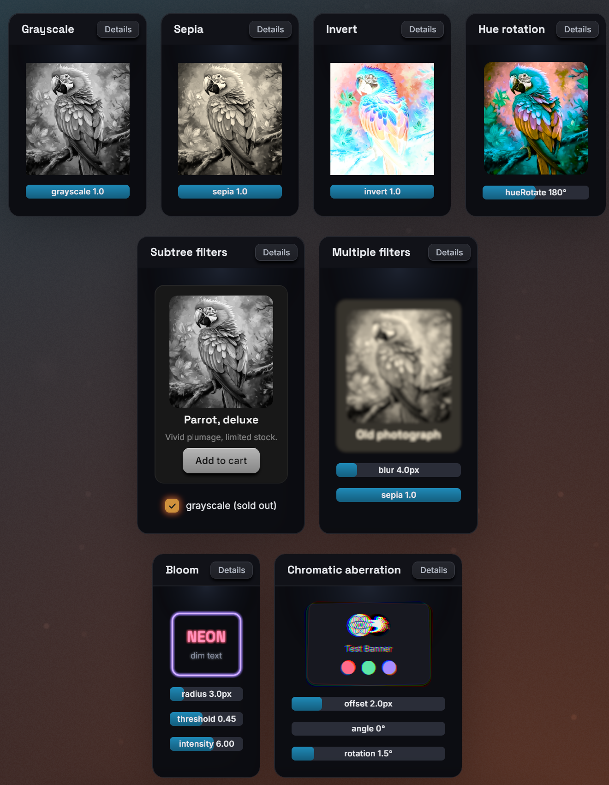

# Filters

The `filter` style runs a chain of GPU shader passes over a node's rendered
result: the node itself and its whole subtree, as one image. bevy-react
ships fourteen filters (blur, color adjustments, bloom, drop shadows,
outlines, gradient recolors and a pinch distortion), and apps can register
their own.

## Usage

```tsx
<image src="images/parrot.png" style={{ filter: { name: "grayscale" } }} />
```

A chain runs its entries in array order, each one over the previous one's
output:

```tsx
<node
  style={{
    filter: [{ name: "blur", params: { radius: 4 } }, { name: "sepia" }],
  }}
>
  <text>Old photo</text>
</node>
```

## Chains

The value is one `{ name, params }` entry or an ordered array of entries.

- `params` and every param in it are optional. An omitted param takes the
  filter's default, which for built-ins is a visible effect, unlike CSS: a
  bare `{ name: "blur" }` is a 20px blur, and a bare `{ name: "grayscale" }`
  is full grayscale.
- Names and params are typed from your generated `bevy.ts`, which lists the
  built-ins and your own filters (see
  [TypeScript codegen](../tooling/ts-codegen.md)). Without generated
  bindings the field accepts no value.
- Length params take a number of logical pixels or a string like `"12px"`. Angle
  params take degrees, or a string such as `"0.5turn"` or `"1rad"`. Color
  params take a CSS color string.
- An entry with an unknown name is skipped with a `filterUnknown` devtools
  warning, and an entry with invalid params (an unknown param, a `%` blur
  radius) with a `filterParams` warning. The rest of the chain still runs.
- Morph filters (`crossfade`, `linearWipe`, `pixelize`) belong to
  [`morphFilter`](morph-filters.md) and are rejected here the same way.
- An empty array is the same as no filter.

## What gets filtered

- A non-empty `filter` promotes the node to a
  [composited layer](layers.md): the subtree is rendered into a texture
  once, and the chain runs over that texture. Changing a param re-runs only
  the filter passes, not the content, so animating params is cheap.
- The image includes the node's own background and border. It works on a
  leaf too: an `<image>`, a `<text>` or an empty colored `<node>`.
- Filters that reach outside the content (a blur, a glow, a shadow, an
  outline) enlarge the layer by their reach on every side, so their effect
  is not cut off at the node's edge. The reach of a chain is the sum of its
  entries' reaches.
- An ancestor's `overflow` clipping clips the filtered result, as on the
  web.
- `opacity` on the same node fades the filtered result as a whole.
- `filter` and [`backdropFilter`](backdrop-filters.md) are independent and
  can be combined on one node.

## Built-in filters

Each table lists the params and their defaults. Lengths are logical pixels
and angles are degrees.

### Color adjustments

Each takes one param and recolors every pixel, keeping its alpha:

| Filter       | Param    | Default | Effect                                                  |
| ------------ | -------- | ------- | ------------------------------------------------------- |
| `brightness` | `amount` | `1`     | Multiplies the color: `0` is black, above `1` brightens |
| `contrast`   | `amount` | `1`     | Scales the distance from mid-gray: `0` is flat gray     |
| `saturate`   | `amount` | `1`     | `0` is grayscale, above `1` oversaturates               |
| `grayscale`  | `amount` | `1`     | Mix toward grayscale: `0` none, `1` full                |
| `sepia`      | `amount` | `1`     | Mix toward sepia: `0` none, `1` full                    |
| `invert`     | `amount` | `1`     | Mix toward the inverted color: `0` none, `1` full       |
| `hueRotate`  | `angle`  | `0`     | Rotates the hue around the color wheel                  |

The defaults follow CSS: `brightness`, `contrast` and `saturate` default to
no change, `grayscale`, `sepia` and `invert` to the full effect.

### `blur`

A Gaussian blur.

| Param    | Default | Effect                                              |
| -------- | ------- | --------------------------------------------------- |
| `radius` | `20`    | Blur radius; the blur reaches three times this far. |

### `bloom`

A glow: bright areas bleed light over their surroundings.

| Param       | Default | Effect                                                     |
| ----------- | ------- | ---------------------------------------------------------- |
| `radius`    | `12`    | How far the glow spreads (it reaches three times this far) |
| `threshold` | `0.7`   | Brightness (`0` to `1`) above which pixels glow            |
| `intensity` | `1`     | Strength of the glow added on top; `0` is no effect        |

`threshold` is perceived brightness: `1` makes nothing glow, `0` makes
everything glow.

### `chromaticAberration`

Color fringing: the red channel shifts one way, blue the opposite way, and
green stays.

| Param      | Default | Effect                                                                  |
| ---------- | ------- | ----------------------------------------------------------------------- |
| `offset`   | `4`     | Shift distance of the red and blue channels                             |
| `angle`    | `0`     | Shift direction, clockwise from the +x axis (`0` is right)              |
| `rotation` | `0`     | Swirl: red turns this many degrees about the center, blue the other way |

`rotation` is a plain number of degrees (no unit strings). The swirl grows
toward the edges and leaves the center clean.

### `gradientMap`

Recolors the content with a linear gradient laid across the node, keeping
the content's alpha. On text, this is gradient text.

| Param    | Default                | Effect                                                                  |
| -------- | ---------------------- | ----------------------------------------------------------------------- |
| `angle`  | `0`                    | Gradient direction: `0` points up, clockwise, like `backgroundGradient` |
| `stops`  | `#38bdf8` to `#a78bfa` | Up to six `{ color, position? }` stops                                  |
| `amount` | `1`                    | Mix from the original color (`0`) to the gradient (`1`)                 |

```tsx
<text
  style={{
    fontSize: 48,
    filter: {
      name: "gradientMap",
      params: {
        angle: 120,
        stops: [
          { color: "#38bdf8" },
          { color: "#a78bfa", position: 0.6 },
          { color: "#f472b6" },
        ],
      },
    },
  }}
>
  Gradient
</text>
```

- `position` is a fraction from `0` to `1` along the gradient line, not a
  percentage. Missing positions are spread evenly, as in CSS.
- The gradient spans the node's border box; the reach of other filters in
  the chain does not stretch it.
- A stop's alpha scales the mix locally: a transparent stop leaves the
  original color.
- Colors interpolate in linear RGB, which can differ slightly from the same
  stops in `backgroundGradient`.

### `outline`

A ring of color around the content's silhouette, drawn under the content:
outlined text, sticker-style icons.

| Param      | Default   | Effect                                                          |
| ---------- | --------- | --------------------------------------------------------------- |
| `width`    | `2`       | Ring width                                                      |
| `color`    | `"black"` | Ring color                                                      |
| `softness` | `0`       | Feathers the outer edge over this many more pixels, like a glow |

The outline follows whatever the chain has produced so far:
`[gradientMap, outline]` outlines the recolored glyphs.

### `shadow`

A drop shadow of the content's silhouette, like CSS `drop-shadow()`, drawn
under the content.

| Param     | Default           | Effect                                       |
| --------- | ----------------- | -------------------------------------------- |
| `color`   | `rgba(0,0,0,0.6)` | Shadow color                                 |
| `offsetX` | `0`               | Horizontal offset; positive moves right      |
| `offsetY` | `4`               | Vertical offset; positive moves down         |
| `spread`  | `6`               | Blur radius of the shadow (not a CSS spread) |

Unlike `boxShadow`, which shadows the node's box, `shadow` follows the
shape of what is drawn: glyphs, transparent images, rounded children.

### `pinch`

Squeezes the content toward a point, or bulges it away, with optional
lighting that shades the distortion like a dented surface.

| Param           | Default | Effect                                                             |
| --------------- | ------- | ------------------------------------------------------------------ |
| `x`, `y`        | `0.5`   | Center of the effect, `0` to `1` across the node                   |
| `strength`      | `0.5`   | `1` is a full pinch, `-1` a full bulge, `0` no effect              |
| `radius`        | `0.8`   | Size of the effect, as a fraction of the node's larger side        |
| `light`         | `0`     | Diffuse shading; `1` is nominal, more overdrives                   |
| `lightAngle`    | `-135`  | Where the light comes from, clockwise from +x (`-135` is top-left) |
| `gloss`         | `0`     | White specular highlight; `1` is nominal                           |
| `glossSize`     | `0.3`   | Highlight size, from `0` (a pinpoint) to `1` (a broad sheen)       |
| `outerSoftness` | `0.5`   | How the effect meets its rim: `0` a crease, `1` imperceptible      |
| `innerSoftness` | `0.5`   | How it peaks at its center: `0` a point, `1` a flat floor          |

Every param is relative to the node, so the effect scales with it. `x` and
`y` use the same `0` to `1` coordinates as pointer events, so a pinch can
follow the cursor directly:

```tsx
import { useSharedValue, withSpring, withTiming } from "bevy-react";

function PinchCard() {
  const strength = useSharedValue(0);
  const x = useSharedValue(0.5);
  const y = useSharedValue(0.5);
  return (
    <node
      onPointerDown={(e) => {
        x.value = e.x;
        y.value = e.y;
        strength.value = withTiming(0.6, { duration: 120 });
      }}
      onPointerUp={() => {
        strength.value = withSpring(0);
      }}
      style={{
        filter: {
          name: "pinch",
          params: {
            x: { animated: x },
            y: { animated: y },
            strength: { animated: strength },
            radius: 0.6,
          },
        },
      }}
    >
      <text>Press me</text>
    </node>
  );
}
```

The [filter reference](../reference/filters.md) lists the same params
with their types.

## Transitions

`transition: { filter }` eases the chain between style states (the base
`style`, `hoverStyle`, `pressStyle`, `focusStyle`):

- Same names in the same order: every param interpolates. Colors ease in
  linear RGB, and angles numerically (`350` to `10` goes the long way).
- One chain extends the other at the end, built-in filters only: the extra
  entries fade through their no-effect values, such as a blur from radius
  `0` or a shadow from transparent. They do not start from the defaults.
- Anything else (different names, a reordered chain, a custom filter added)
  swaps at the halfway point.
- Easing to no chain at all, by removing `filter` or setting `[]`, snaps:
  the filter disappears at once.

Keep a no-effect entry in the base style when the filter should fade out as
well as in:

```tsx
<node
  style={{
    filter: { name: "blur", params: { radius: 0 } },
    transition: { filter: { duration: 250 } },
  }}
  hoverStyle={{ filter: { name: "blur", params: { radius: 6 } } }}
/>
```

A `filter` in a state style replaces the base chain as a whole. A
no-effect entry still keeps the node a composited layer, with its memory
and capture cost (see [Layers](layers.md)).

## Animated params

Any param accepts an inline `{ animated }` binding to a shared value,
driven every frame on the Bevy side without re-rendering React:

```tsx
import { useSharedValue, withTiming } from "bevy-react";

function Reveal() {
  const radius = useSharedValue(12);
  return (
    <node
      onPointerEnter={() => {
        radius.value = withTiming(0);
      }}
      style={{
        filter: {
          name: "blur",
          params: { radius: { animated: radius, seed: 12 } },
        },
      }}
    />
  );
}
```

- Values are in the param's units: pixels for lengths, degrees for angles.
  Color params take an `interpolateColor` binding.
- `gradientMap` stops cannot be bound; its `angle` and `amount` can.
- Bindings work in the base `style` only. A binding in `hoverStyle`,
  `pressStyle` or `focusStyle` is ignored with a warning.
- Any binding on a `filter` param parks `transition: { filter }` for that
  node: the binding wins.
- `seed` is the static value used in the binding's place for what is
  computed up front, such as how far a blur reaches outside the node. Size
  it for the largest value the animation reaches. Without a seed the
  filter's default is used (20px for `blur`).

See [Animated values](../animations/animated-values.md) for the drivers.

## Shader compilation

Each filter is a GPU pipeline, compiled in the background before its first
use. While a node's filters are compiling, the node is not drawn at all,
rather than flashing unfiltered. By default every built-in and registered
filter is compiled at startup, so this normally only shows if you narrow
it with `precompile_filters`:

```rust
use bevy_react::{FilterSelection, PrecompileFilters};

app.add_plugins(ReactPlugins.set(
    ReactUiPlugin::default().precompile_filters(PrecompileFilters {
        builtins: FilterSelection::Names(vec!["blur".into()]),
        ..default()
    }),
));
```

`builtins`, `filters` (your `add_react_filter` filters) and `morphs` (your
morph filters) each take `All` (the default), `Names(..)` or `Off`. A
shader that fails to compile keeps the node invisible and logs the error to
the terminal, naming the layer.

## Limits

- `bloom` and `shadow` draw their effect over the node's unfiltered
  content, so every filter before them in the chain is lost: `[blur, bloom]`
  shows no blur. Put them first in the chain; the filters after them apply
  normally.
- A `pinch` bulge, and a `chromaticAberration` swirl (`rotation`), can only
  spill about 16px outside the node; beyond that they are cut off at a
  straight edge. Keep a margin inside the node, or a smaller strength.
- `outline` stays crisp up to about 12 physical pixels of width plus
  softness; typical text outlines are 1 to 6 pixels.
- `gradientMap` takes at most six stops.
- A nested `<text>` span cannot take a filter (`spanLayerStyle` warning);
  put it on the outer `<text>` or a wrapping `<node>`.
- The [layer limits](layers.md#limits) apply: content painted outside the
  node's border box (plus the chain's reach) is cut off, and inside a
  `<surface>` the node renders unfiltered.



To write your own filters in WGSL, see
[Custom filters](../extending/custom-filters.md).

See [`filter`](../reference/style-properties.md#filter) in the style
reference, and [`bloom`](../reference/filters.md#bloom),
[`blur`](../reference/filters.md#blur),
[`brightness`](../reference/filters.md#brightness),
[`chromaticAberration`](../reference/filters.md#chromaticAberration),
[`contrast`](../reference/filters.md#contrast),
[`gradientMap`](../reference/filters.md#gradientMap),
[`grayscale`](../reference/filters.md#grayscale),
[`hueRotate`](../reference/filters.md#hueRotate),
[`invert`](../reference/filters.md#invert),
[`outline`](../reference/filters.md#outline),
[`pinch`](../reference/filters.md#pinch),
[`saturate`](../reference/filters.md#saturate),
[`sepia`](../reference/filters.md#sepia) and
[`shadow`](../reference/filters.md#shadow) in the filter reference.
