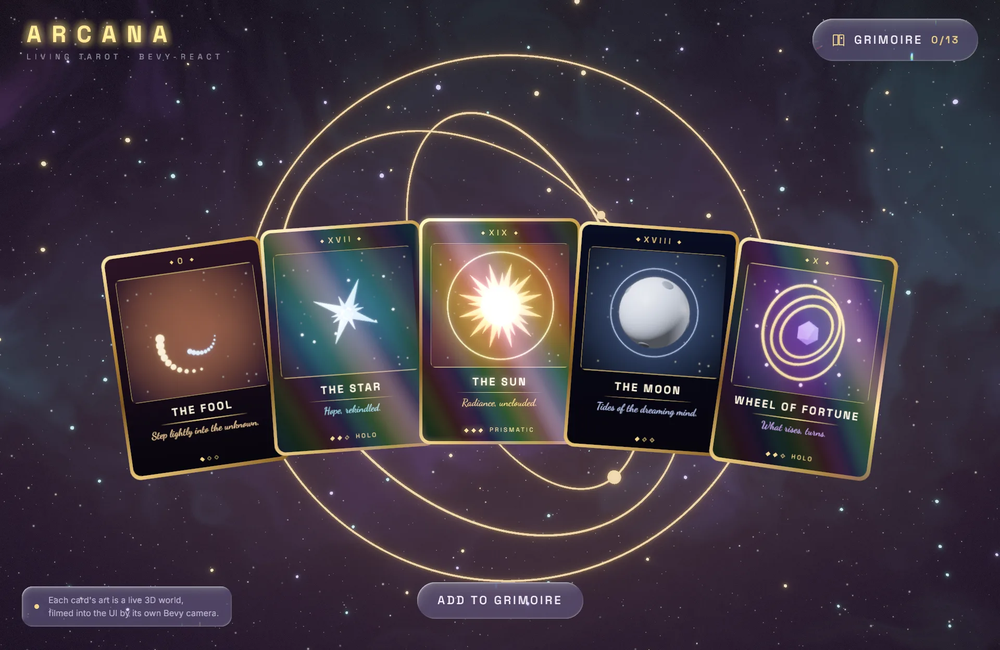

# Arcana

The bevy-react showcase: open packs of living tarot cards. Everything you click
is a React component; everything it does is Bevy — and most of it is impossible
with a DOM.



```sh
npm install                  # once, from the repo root
npm run build -w arcana      # build the React bundles
cargo run -p arcana
```

`npm run watch -w arcana` rebuilds on save; edits hot-reload with component state
intact.

## Play

1. **Tear the pack** — swipe across its top strip (or click it). The strip flies
   off and the wrapper burns away from the cut.
2. **Turn the cards** — click each. Rares turn holographic; a legendary rings
   through the whole sky. A legendary waiting face-down breathes gold.
3. **Add to grimoire** — the cards fly into your collection; a new pack appears.
4. **Hold a card** — click a turned card (or one in the grimoire). It leaves the
   UI and becomes a real 3D card: drag to turn it, flip it to read its back, and
   click the heart — in 3D. Esc puts it back.

## What you're looking at

| On screen                               | How                                                                                                                                                                                                                                                         |
| --------------------------------------- | ----------------------------------------------------------------------------------------------------------------------------------------------------------------------------------------------------------------------------------------------------------- |
| The card art                            | Thirteen procedural 3D dioramas, each filmed by its own camera into a render target that React shows with `<portal>`; a target renders only while its card is on screen and is sized to it (`dioramas/`).                                                   |
| Holographic foil                        | `holo`, a custom WGSL filter over the card's rendered pixels; its `angle` is an animated value bound to the card's sway (`filters.rs`, `assets/shaders/holo.wgsl`).                                                                                         |
| The pack burning open                   | `burn`, a custom filter whose `progress` is an animated value; the cards are dealt beneath it.                                                                                                                                                              |
| Card deal, flip, flight to the grimoire | `transform3d` with `{ animated }` fields. Each card's whole life is one value mapped through multi-stop `interpolate` (in the pack → dealt → collected); the flip is another. React re-renders only when a card turns over (`ui/src/Fan.tsx`).              |
| Glass buttons                           | `liquidGlass`, a custom backdrop filter: the live 3D frame behind the button refracted through a rounded bezel, with chromatic dispersion and a lit rim (`assets/shaders/glass.wgsl`).                                                                      |
| Table ↔ grimoire                        | `veil`, a custom morph filter on `morphFilter`: the old screen recedes under a smoky golden front.                                                                                                                                                          |
| The held 3D card                        | The same `<CardFront>` component rendered into `<surface>` and draped over a mesh, drawn by its own untonemapped camera, so at rest it matches the flat card pixel for pixel. The foil and glint come from the real view angle (`inspect.rs`, `foil.wgsl`). |
| The legendary flare                     | A typed message, `bevy.arcana.flare({ hue })`, generated into `ui/src/bevy.ts` from the Rust struct (`stage.rs`).                                                                                                                                           |

## Performance

The heaviest view is a full grimoire, with all thirteen worlds live at once.
While more than six are live, the diorama cameras drop HDR and bloom, and the
full-screen morph layer exists only while a screen change is in flight. On an
Intel Iris Xe the table holds about 60 fps in a dev build and a full grimoire
about 50.

## Scripted screenshots

`--shoot` renders offscreen, plays scripted steps, and saves a PNG:

```sh
cargo run -p arcana -- --shoot out.png 7 --scale 1.5 \
  --do "0.3 pack fool,star,sun,moon,wheel" --do "1 tear" --do "3.4 flipAll"
```

The steps are listed in `shoot.rs`.
