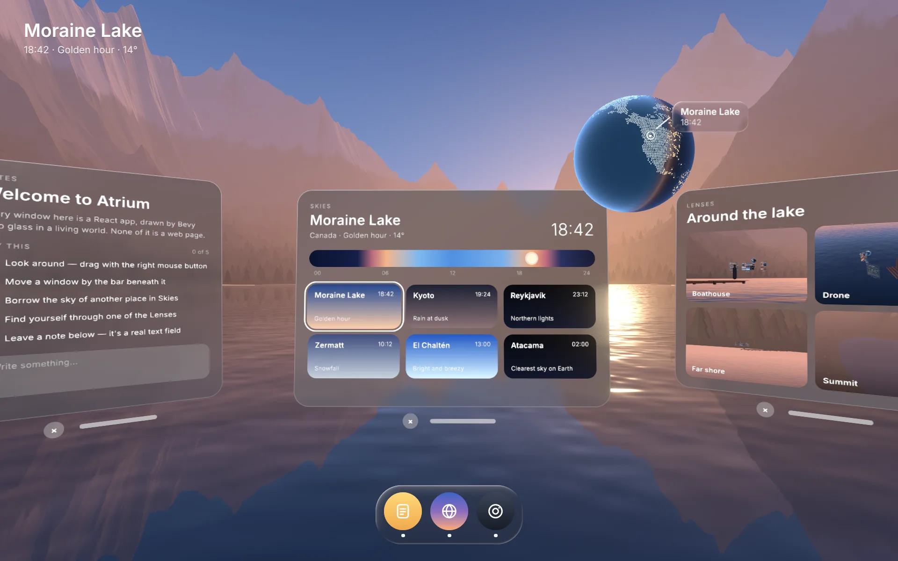
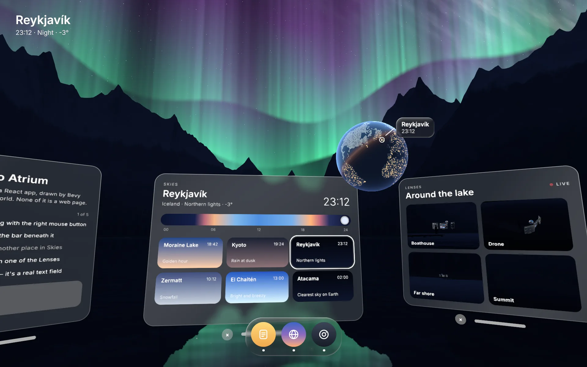
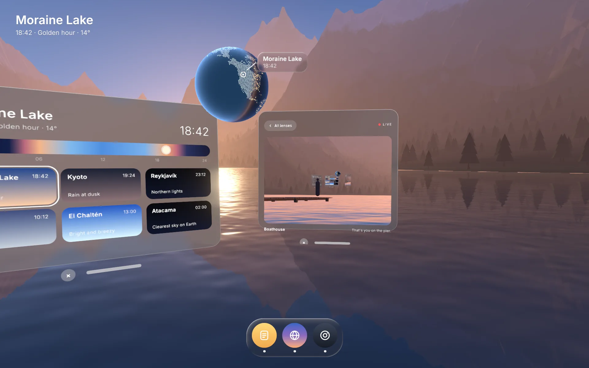

# Atrium

A spatial desktop built with bevy-react. You stand at the end of a pier on an
alpine lake, and around you float windows of frosted glass. Every window is a
React app, and every one of them is a real object in a living 3D world.



```sh
npm install                  # once, from the repo root
npm run build -w atrium      # build the React bundles
cargo run -p atrium
```

`npm run watch -w atrium` rebuilds on save; edits hot-reload with component
state intact.

## Try

- **Look around**: drag with the right mouse button, or the left one on open
  sky.
- **Move a window**: drag the bar under it. It follows you around, always
  turned toward you; scroll while dragging to push it away or pull it in.
- **Borrow a sky**: pick a place in Skies. The world plays the hours between
  as a time-lapse, and the globe turns to the place, its day/night line where
  it really is at that hour. Reykjavík has the northern lights, Kyoto rains,
  Zermatt snows. Drag along the day to scrub its light.
- **Find yourself**: open a lens. The far-shore telephoto and the boathouse
  camera see a figure on the pier among glowing windows.
- **Write a note**: the Notes window holds a real text field.
- Finish the tour in Notes and look at the lake.

The dock opens a closed app, or brings an open one to wherever you are
looking.



## What you're looking at

| On screen                     | How                                                                                                                                                                                                                                                                                      |
| ----------------------------- | ---------------------------------------------------------------------------------------------------------------------------------------------------------------------------------------------------------------------------------------------------------------------------------------- |
| The windows                   | Each app renders into a `<surface>` (React drawn into a texture, at a DPI scale matched to your screen) shown on a pane whose shader frosts the live world behind it, bends it along a rounded bevel and composites the UI exactly. Clicks are ray-cast into it (`panes/`, `pane.wgsl`). |
| Opening a window              | The glass condenses upward out of noise along a line of light, in the pane's shader.                                                                                                                                                                                                     |
| Moving a window               | React's grab bar sends `bevy.panes.grab`; Bevy then moves the pane around a cylinder centered on you until you release.                                                                                                                                                                  |
| The world                     | One palette uniform eased through a day: the sky, the faceted land, the fog and the lake all read it, so a new place re-lights everything at once (`world/`). The sun follows real solar geometry.                                                                                       |
| The lake                      | A mirror camera below the surface films the world, your windows included, and the water shader samples it through the ripples, with a glittering sun path and rain rings (`world/water.rs`).                                                                                             |
| Rain, snow, fireflies         | One mesh of quads per kind, animated in the vertex shader: one draw call each (`world/weather.rs`).                                                                                                                                                                                      |
| The globe                     | A 3D sphere leaning out of the Skies window, continents as dots from a Natural Earth land mask, lit for the moment's UTC time, with city lights on its night side (`globe.rs`, `globe.wgsl`).                                                                                            |
| The globe's label             | `<anchor entity={pin}>`: screen-space React, glass included, pinned to a 3D point on the turning globe.                                                                                                                                                                                  |
| The lenses                    | Four cameras around the lake rendering into `<portal>` targets, live only while shown. Opening one flies the tile into the big view as a shared element (`lenses.rs`, `ui/src/apps/Lenses.tsx`).                                                                                         |
| The dock                      | `liquidGlass`, a custom backdrop filter: the 3D frame behind the dock, refracted through a rounded bezel.                                                                                                                                                                                |
| The place name, top left      | `condense`, a custom morph filter: a new place forms out of noise, the way the windows do.                                                                                                                                                                                               |
| The clock during a time-lapse | Bevy streams the sky's hour back (`skies.now`, a typed event), so the HUD, the scrubber and the globe's label sweep through the day with it.                                                                                                                                             |

Every message, request and event between React and Bevy is a Rust struct,
generated into `ui/src/bevy.ts`.



## Performance

On an Intel Iris Xe, a dev build with every window open runs at 60 fps in
the default 1440×900 window and takes about 17 ms a frame at 1920×1080. The
world renders up to six times a frame (you, the mirror, the four lenses), so
the lens cameras run only while their portals are on screen, the mirror
renders at 40% resolution, and antialiasing is SMAA rather than MSAA.

## Scripted screenshots

`--shoot` renders offscreen, plays scripted steps, saves a PNG and prints the
average frame time:

```sh
cargo run -p atrium -- --shoot out.png 10 --scale 1.5 \
  --do "2 pick reykjavik" --do "9.5 look -6 9"
```

The steps are listed in `shoot.rs`. Run the binary directly with
`BEVY_ASSET_ROOT=examples/atrium`, or assets resolve against `target/`.

The land mask behind the globe is rasterized from
[Natural Earth](https://www.naturalearthdata.com/) (public domain).
