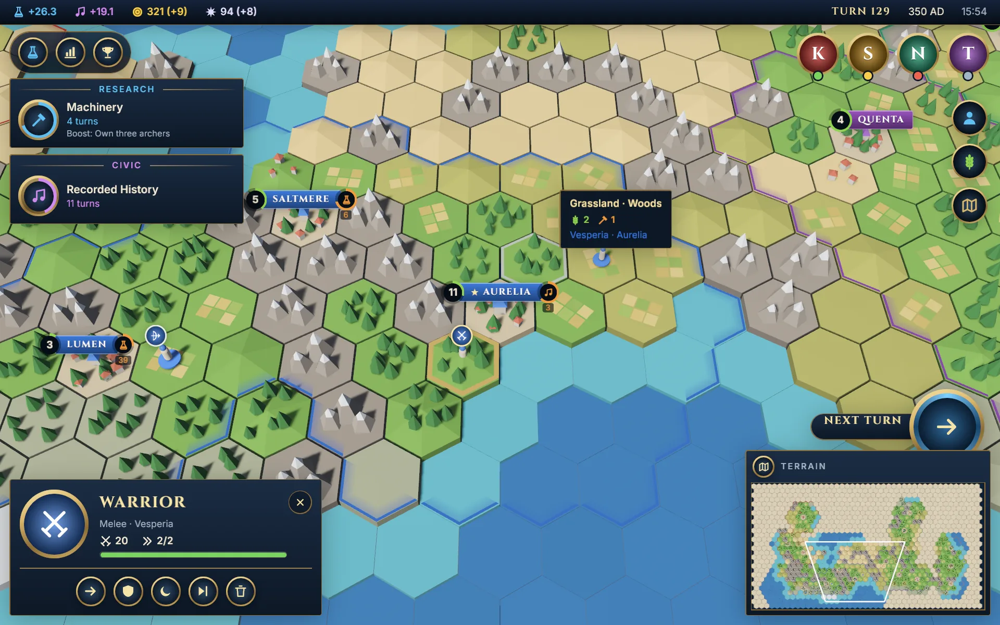
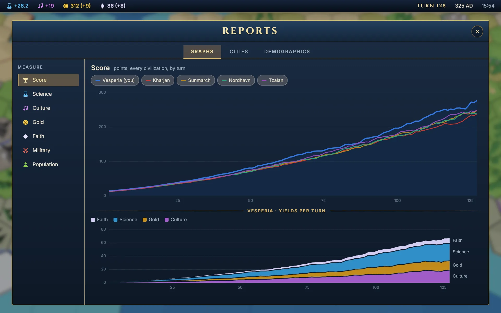
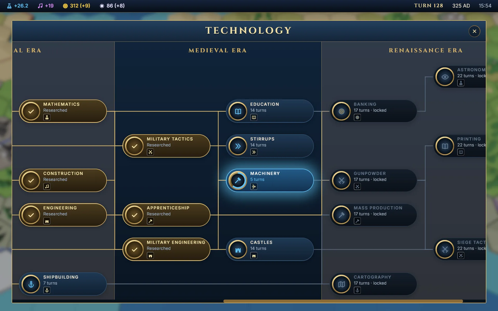

# Civilization

The interface of a 4X strategy game, after the great turn-based empire
builders, built with bevy-react. A generated hex world is Bevy; every panel,
banner, tooltip, tree and graph over it is React. No game is played: the
empire's numbers are made up, but they come from the map.



```sh
npm install                     # once, from the repo root
npm run build -w civilization   # build the React bundles
cargo run -p civilization
```

`npm run watch -w civilization` rebuilds on save; edits hot-reload with
component state intact.

It also runs in the browser:
[play it on GitHub Pages](https://tulustul.github.io/bevy-react/civilization/),
or build the wasm version yourself with `npm run build:web -w civilization`
(it serves the result; see [Web builds](../../docs/guide/tooling/web.md)).

## Try

- **Look around**: drag the map, or use WASD or the arrow keys; the wheel
  zooms. Click the minimap to jump.
- **Hover a tile** for its terrain and yields; **click a city** (its banner or
  its tile) for the city panel, and pick what it builds next. Click a unit's
  flag for its orders.
- **Next turn** (or Enter): the year moves on, yields pile up, research
  finishes, notifications slide in. When your scholars are idle the button
  asks you to choose a research.
- **The screens**, from the round buttons top left: the technology tree,
  the reports (history graphs, your cities, demographics) and the world
  rankings. Esc closes them.
- **The political lens**, above the minimap, paints every civilization's
  territory in its color.



## What you're looking at

| On screen                     | How                                                                                                                                                                                                              |
| ----------------------------- | ---------------------------------------------------------------------------------------------------------------------------------------------------------------------------------------------------------------- |
| The map                       | One seeded world: value-noise terrain, mountain ranges along ridges, five civilizations settled across it. Tiles, woods, mountains and towns are one flat-shaded, vertex-colored mesh built on the CPU (`map/`). |
| City banners, unit flags      | `<anchor>`: screen-space React pinned to a point above each town and figure, following the camera.                                                                                                               |
| The tile tooltip              | Also an `<anchor>`, pinned to the ring Bevy puts on the hovered tile. Bevy ray-casts the pointer onto the hex grid and sends the tile (`map.hover`, a typed event) only when it changes.                         |
| The numbers                   | Every city's yields come from the tiles it works on the map (`world.rs`), sent to React once (`bevy.map.world()`); the top bar, the city panel and the reports add them up.                                      |
| The minimap                   | A `<portal>` of a second, top-down camera filming the whole map; your view is outlined on it by a gizmo only that camera sees. Clicking sends `bevy.map.jump`.                                                   |
| The panels, rings and buttons | Gradients: a gilt ring is a linear gradient, a progress ring a conic one with a hard stop. Icons are `<svg>` paths.                                                                                              |
| The graphs                    | `<svg>` polylines and polygons; crosshairs, readouts and labels are nodes over them, so hovering never redraws the chart.                                                                                        |
| A screen opening              | A `blur` backdrop filter over the live 3D frame, and the panel fading in on an animated value.                                                                                                                   |
| The political lens            | `bevy.map.lens(…)`: Bevy rebuilds the land mesh in its owners' colors; the minimap follows by itself.                                                                                                            |

Every message, request and event between React and Bevy is a Rust struct,
generated into `ui/src/bevy.ts`.



## Performance

On an Intel Iris Xe, a dev build at 1440×900 takes about 16 ms a frame on
the map and 11 ms with a screen open.

## Scripted screenshots

`--shoot` renders offscreen, plays scripted steps, saves a PNG and prints the
average frame time:

```sh
cargo run -p civilization -- --shoot out.png 5 --scale 1.5 \
  --do "1 turn" --do "1.5 hover 20 20"
```

The steps are listed in `shoot.rs`. Run the binary directly with
`BEVY_ASSET_ROOT=examples/civilization`, or assets resolve against `target/`.

The headings are set in [Cinzel](https://github.com/NDISCOVER/Cinzel)
(SIL Open Font License).
