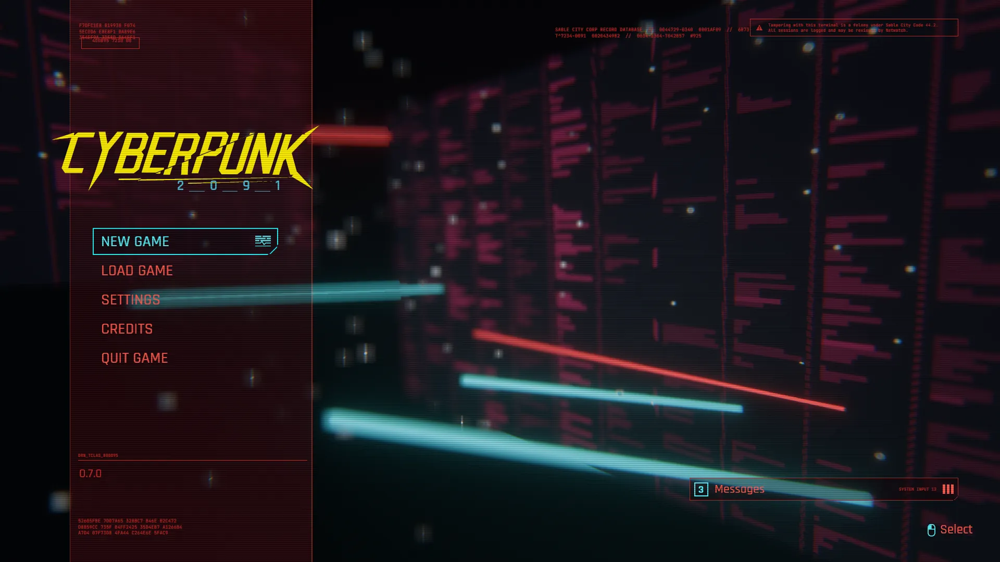
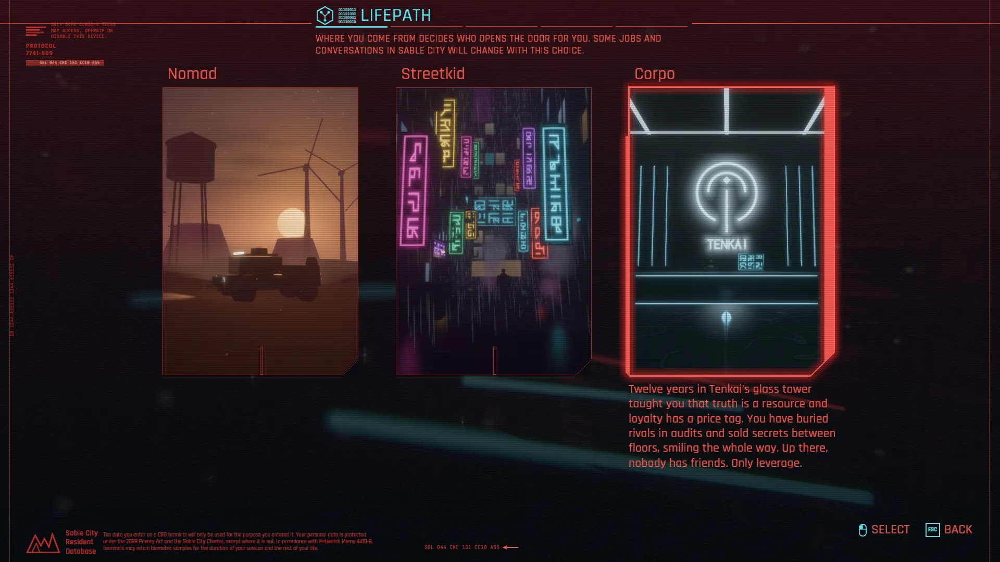
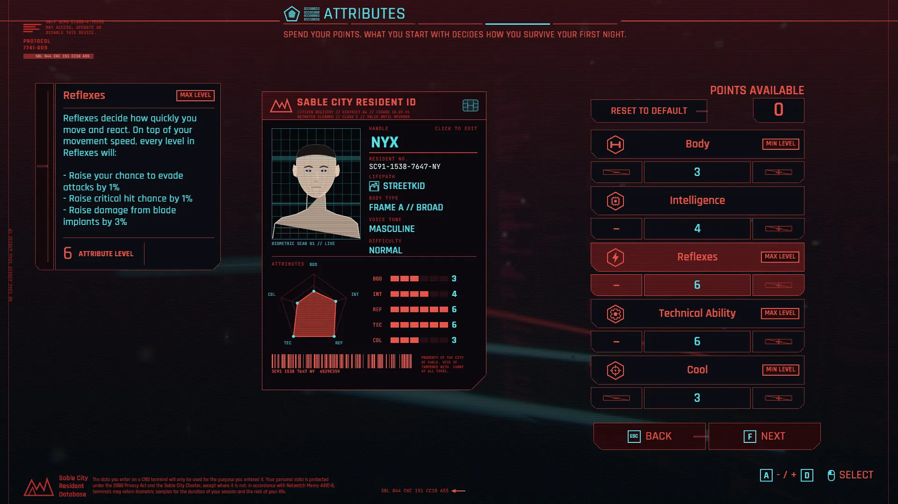
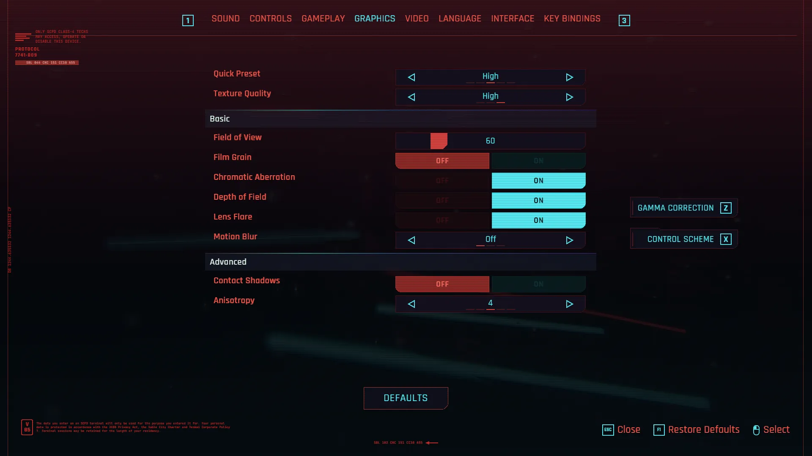
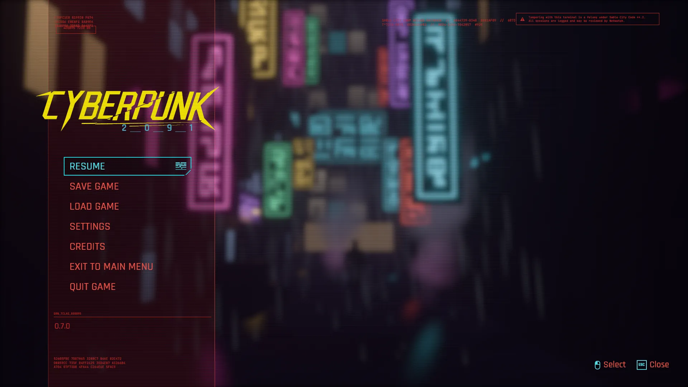

# Cyberpunk

A homage to the front end of a certain open-world RPG, built with
bevy-react: the title screen, the main menu, every view behind it, and the
pause menu once you are in. Every screen is React; everything behind and
inside the screens is Bevy.



```sh
npm install                   # once, from the repo root
npm run build -w cyberpunk    # build the React bundles
cargo run -p cyberpunk
```

`npm run watch -w cyberpunk` rebuilds on save; edits hot-reload with
component state intact.

It also runs in the browser:
[play it on GitHub Pages](https://tulustul.github.io/bevy-react/cyberpunk/), or
build the wasm version yourself with `npm run build:web -w cyberpunk` (it serves
the result; see [Web builds](../../docs/guide/tooling/web.md)).

## Try

- **The title screen**: Space (or a click) starts BREACHING… and the main
  menu.
- **NEW GAME** walks the six steps: pick a difficulty (the street on the card
  burns hotter as you go up), a lifepath, a body type, then shape your look
  and spend your attribute points while the resident ID card follows every
  choice. Click the handle on the card to rename yourself. START loads you
  into your lifepath's world.
- **Esc** in game opens the pause menu over the blurred world: SAVE GAME
  adds a slot (kept for the session), LOAD GAME lists them with snapshots of
  their worlds.
- **SETTINGS**: eight tabs. Field of view, depth of field, chromatic
  aberration, lens flare and motion blur change the camera behind the menus;
  windowed mode, resolution and VSync change the window; GAMMA CORRECTION (Z)
  changes the color grading; the volume sliders drive the synthesized sound.
  Key bindings rebind: click one, press a key.
- **Credits** scroll on their own; hold F to fast-forward.
- Arrows and Enter drive the menus, Esc goes back; the hints at the bottom
  right are clickable.

## What you're looking at

| On screen                         | How                                                                                                                                                                                                                                                                                        |
| --------------------------------- | ------------------------------------------------------------------------------------------------------------------------------------------------------------------------------------------------------------------------------------------------------------------------------------------ |
| The world behind the menus        | The datascape: panels of dot-matrix data scrolling in a WGSL material, neon bars and drifting dust, filmed through bloom, depth of field (a large virtual sensor, so the wide shot still focuses shallow), chromatic aberration and a vignette. It is also the UI camera (`datascape.rs`). |
| The cut corners on every plate    | No clip paths: a linear gradient whose line starts at the corner is transparent for the cut and solid after it, and the same gradient on the border stops both sides at the cut (`chamfer` in `ui/src/theme.ts`).                                                                          |
| The wordmark breaking up          | `glitch`, a custom WGSL filter over the wordmark's pixels: torn slices and split channels, striking in random bursts that the shader times itself, so React renders once (`filters.rs`, `assets/shaders/glitch.wgsl`). On the title it lies on a `transform3d` plane.                      |
| Every screen change               | `glitchSwap`, a custom morph filter: bands of the old screen flip to the new one at staggered moments. The morph is armed only while a change is in flight (`App.tsx`).                                                                                                                    |
| Film grain                        | `grain`, a time-driven filter on an empty full-screen node under the menus: its pass writes fresh noise every frame over the 3D world.                                                                                                                                                     |
| The difficulty and lifepath cards | Four procedural dioramas, each on its own render layer, filmed by its own camera into a `<portal>`: the burning street (its fire follows `bevy.dioramas.difficulty`), the badlands, a neon alley, the Tenkai lobby (`dioramas/`).                                                          |
| The save thumbnails               | The same worlds filmed once into fixed-size `Snapshot` targets: rendered when created, then free.                                                                                                                                                                                          |
| The game world                    | A `world` camera that `bevy.dioramas.world({ lifepath })` moves into your lifepath's diorama, shown by a full-screen `<portal>`; pausing blurs it with a `blur` filter.                                                                                                                    |
| The live settings                 | Typed messages generated into `ui/src/bevy.ts` (`settings.graphics`, `settings.video`, `settings.gamma`, `sound.volume`): Bevy inserts or removes the camera's post-processing components, writes the window, sets `ColorGrading` (`settings.rs`).                                         |
| The gamma test image              | `gamma`, a custom color filter: the test image goes through the same curve the setting puts on the world.                                                                                                                                                                                  |
| The resident ID card              | `<svg>` all the way down (the scanned portrait, the radar, the barcode) and an `<editableText>` for the handle.                                                                                                                                                                            |
| The sound                         | Synthesized at startup into in-memory buffers that bevy_audio plays through a custom `Decodable`: seven UI blips and a looping drone, no audio files (`sound/`).                                                                                                                           |

The UI is laid out at 1080p whatever the window: the window's scale factor
follows its height (`fit_ui_to_1080p` in `main.rs`), so every size in the
React code is a 1080p pixel and the text stays crisp.







## Performance

Every screen renders in 2–4 ms a frame in a dev build at 1920×1080 on an
RTX 3070; the heaviest is the lifepath step, with three diorama cameras
live at once (about 5.5 ms). A diorama camera costs about 1 ms whatever its
size, renders only while a portal shows it, and the save thumbnails are
snapshots: rendered once, then free. While a game runs, the datascape
behind the full-screen world is hidden.



## Scripted screenshots

`--shoot` renders offscreen, plays scripted steps, saves a PNG and prints the
average frame time. `--size` is the capture's size in physical pixels (the UI
is always laid out at 1080p):

```sh
cargo run -p cyberpunk -- --shoot out.png 3 --size 2560x1440 \
  --do "0.3 go newgame" --do "0.6 step lifepath"
```

`go <screen>` jumps to a screen and `play <lifepath>` straight into the
game; each screen adds its own verbs (`step`, `tab`, `set`, `hover`…, see
`useDebug` in `ui/src`). Run the binary directly with
`BEVY_ASSET_ROOT=examples/cyberpunk`, or assets resolve against `target/`.

## Credits

Inspired by the menus of Cyberpunk 2077 by CD PROJEKT RED. The wordmark,
the city, its corporations and every line of text here are our own; nothing
is affiliated with or endorsed by CD PROJEKT RED.

The interface is set in [Rajdhani](https://github.com/itfoundry/rajdhani)
by the Indian Type Foundry (SIL Open Font License), the small print in
[JetBrains Mono](https://github.com/JetBrains/JetBrainsMono).
